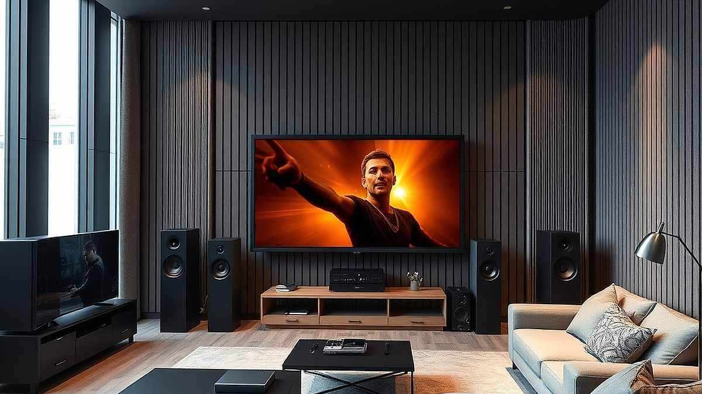

## 공간 음향(Spatial Audio)이 바꾸는 홈시어터 라이프

공간 음향(Spatial Audio) 기술은 이제 거창한 영화관을 넘어 우리 집 거실의 음악 감상 환경을 근본적으로 바꾸고 있습니다. 과거에는 5.1채널이나 7.1채널 같은 물리적인 스피커 배치가 홈시어터의 전부였지만, 이제는 소리가 단순히 좌우에서 들리는 것을 넘어 머리 위와 뒤, 그리고 입체적인 공간감을 형성하며 연주자의 위치를 재현합니다. 문제는 기술의 진입 장벽입니다. 마케팅 문구만 보면 마치 스피커 몇 개만 두면 콘서트홀이 될 것 같지만, 실제로는 거실의 구조와 사용자의 청취 습관에 따라 체감 효과가 극명하게 갈립니다. 

오늘 다룰 내용은 30평대 아파트 거실을 기준으로, 복잡한 배선 없이 공간 음향을 도입하려는 입문자를 위한 가이드입니다. 수백만 원대의 하이엔드 오디오를 구축하기 전에, 지금 당장 여러분의 거실에서 공간 음향이 효과를 발휘할지, 아니면 돈 낭비가 될지 판단하는 기준을 제시하겠습니다. 막연한 감성보다는 소리가 튕겨 나가는 벽면의 재질, 소파의 배치, 그리고 여러분이 주로 듣는 음악 장르에 따른 실전 전략을 확인해 보시기 바랍니다.

## 내 거실은 공간 음향을 받아들일 준비가 되었는가

공간 음향은 소리를 벽이나 천장에 반사시켜 청자에게 전달하는 원리를 활용합니다. 따라서 거실이 지나치게 개방적이거나 흡음재 역할을 하는 가구가 너무 많으면 기술의 효과는 반감됩니다. 가장 먼저 체크해야 할 것은 천장의 높이와 재질입니다. 소리가 천장에 부딪혀 내려와야 하는 '애트모스(Atmos)' 효과를 구현하려면, 천장이 평평하고 단단한 석고나 콘크리트 재질이어야 합니다.

만약 여러분의 거실 천장에 화려한 몰딩이 많거나, 층고가 너무 높고 경사져 있다면 소리의 반사 지점이 분산됩니다. 이 경우 스피커를 아무리 좋은 것으로 배치해도 소리가 흩어집니다. 

**실패 케이스:** 거실 한쪽 벽면을 전부 통유리창으로 만들고, 반대편은 두꺼운 커튼으로 완전히 덮은 경우입니다. 유리는 소리를 반사하지만 커튼은 소리를 흡수해버립니다. 이 상태에서는 소리의 위상 차이가 무너져 공간 음향 특유의 입체감이 사라지고, 그저 소리가 멍멍해지는 현상만 남습니다.

**선택 기준:** 거실의 가로세로 비율이 1.5대 1 이내이고, 스피커를 배치할 위치에서 천장까지의 거리가 2.5미터에서 3미터 사이일 때 가장 효과가 좋습니다. 만약 거실이 너무 넓다면 공간 음향보다는 스테레오 이미징을 강화하는 방향이 훨씬 경제적이고 효율적입니다.

## 장비 선택의 실전 체크리스트: 올인원 바인가, 분리형인가

입문자가 가장 고민하는 지점은 '사운드바'와 '분리형 스피커 시스템' 사이의 선택입니다. 결론부터 말하자면, 여러분이 음악 감상과 영화 시청 비율을 5:5로 둔다면 사운드바 형태의 공간 음향 기기가 훨씬 유리합니다. 분리형 시스템은 설정 난이도가 높고, 케이블 정리만으로도 주말 하루를 다 써야 합니다.

**실전 체크리스트:**
1. **케이블 매립 가능 여부:** 거실 바닥에 전선이 지나다니는 것을 참을 수 있는가? (아니라면 사운드바 필수)
2. **청취 위치의 고정성:** 소파에 앉아 정면을 바라보는 위치가 항상 고정되어 있는가? (공간 음향은 스윗 스팟이 존재하므로 고정석이 없으면 효과가 적음)
3. **음악 장르:** 보컬 중심의 팝이나 재즈를 주로 듣는가, 아니면 웅장한 오케스트라 사운드를 즐기는가? (오케스트라는 분리형이 압도적이지만, 대중음악은 요즘 사운드바의 공간 음향 알고리즘이 매우 정교함)

**실패 케이스:** 무조건 비싸고 커다란 스피커가 좋다는 생각에 좁은 거실에 대형 톨보이 스피커를 배치하는 경우입니다. 스피커 간의 거리가 너무 가까우면 소리가 섞여버려 공간 음향이 지향하는 '분리된 악기 소리'를 들을 수 없습니다.

**핵심 기준:** 예산이 100만 원 이하라면 성능이 검증된 브랜드의 하이엔드 사운드바를, 300만 원 이상을 투자할 의향이 있고 거실 전용 공간을 확보할 수 있다면 5.1.2채널 이상의 분리형 시스템을 고려하세요.

## 공간 음향을 200% 활용하는 세팅 노하우

장비를 갖췄다면 이제 세팅입니다. 많은 분이 자동 캘리브레이션(기기가 소리를 측정해 환경에 맞추는 기능)만 믿고 끝내는데, 이는 절반의 성공일 뿐입니다. 공간 음향은 '소리의 경로'를 최적화하는 것이 핵심입니다.

가장 먼저 해야 할 일은 스피커와 벽면 사이의 거리를 확보하는 것입니다. 많은 사람이 스피커를 벽에 딱 붙여 놓는데, 이렇게 하면 저음이 과하게 강조되어 중고음의 섬세한 입체감을 다 잡아먹습니다. 최소 10cm에서 20cm 정도는 벽에서 띄워야 소리가 뒤쪽 벽을 타고 자연스럽게 회절하며 공간감을 만들어냅니다.

또한, 음악 감상 시에는 기기의 '업믹싱(Upmixing)' 기능을 적절히 조절해야 합니다. 스테레오로 녹음된 일반 음악을 강제로 공간 음향으로 변환하면 보컬이 기괴하게 울리는 경우가 있습니다. 이를 방지하려면 기기 설정에서 '뮤직 모드'를 선택하고, 서라운드 효과 강도를 중간 이하로 설정하는 것이 좋습니다.

**실전 팁:**
- **청취 높이:** 소파에 앉았을 때 귀의 높이와 메인 스피커의 트위터(고음 유닛) 높이를 일치시키세요. 의자 높이가 낮다면 스피커 스탠드를 활용해 높이를 조절하는 것만으로도 소리의 선명도가 즉각적으로 변합니다.
- **반사 방지:** 스피커와 청취자 사이의 바닥에 작은 러그를 깔아보세요. 바닥에서 튀어 오르는 불필요한 소리를 잡아주어 공간 음향의 입체감이 훨씬 명료해집니다.

**실패 케이스:** 모든 설정을 '최대'로 올려두는 경우입니다. 공간감을 최대치로 높이면 음악의 원형이 왜곡되어, 연주자가 바로 옆에서 연주하는 느낌이 아니라 마치 동굴 속에서 듣는 듯한 이질감이 생깁니다.

공간 음향 기술은 거실을 단순히 소리가 울리는 공간이 아니라, 음악의 질감을 입체적으로 느낄 수 있는 감상실로 바꿔줍니다. 하지만 이 기술은 장비의 가격보다 여러분의 거실 환경을 이해하고, 그에 맞춰 스피커의 위치를 조금씩 조정하는 '정성'에 더 큰 영향을 받습니다. 

지금 당장 여러분의 거실 스피커 위치를 5cm만 뒤로 옮겨보고, 평소 즐겨 듣던 라이브 음원을 재생해 보세요. 소리의 정위감(악기 위치가 느껴지는 정도)이 달라지는 것을 체감한다면, 여러분은 이미 홈시어터의 즐거움을 제대로 누릴 준비가 된 것입니다. 장비의 스펙을 읽는 시간보다, 실제로 소리를 들으며 소파의 위치를 조정하는 10분이 여러분의 오디오 라이프를 훨씬 풍요롭게 만들 것입니다. 오늘 바로 거실을 여러분만의 작은 콘서트홀로 만들어 보시기 바랍니다.

## 마치며

결국 공간 음향의 핵심은 단순히 고가의 장비를 갖추는 것이 아니라, 소리가 머무는 공간과 그 안에서 음악을 즐기는 사람의 정성에 달려 있습니다. 기술은 거실을 근사한 감상실로 바꿔주는 도구일 뿐, 그 공간에 생명력을 불어넣는 것은 바로 여러분의 작은 변화입니다.

오늘 당장 스피커 위치를 조금씩 조정해 보며 소리의 결을 찾아보세요. 거창한 장비 업그레이드보다 훨씬 더 놀라운 변화를 경험하게 될 것입니다. 소리에 집중하는 그 10분의 시간은 여러분의 일상을 더욱 깊고 풍성한 예술적 경험으로 채워줄 것입니다.

이제 여러분의 거실을 세상에서 가장 편안하고 완벽한 콘서트홀로 만들어 보세요. 음악이 주는 입체적인 감동이 여러분의 일상 속에 자연스럽게 스며들기를 바랍니다. 오늘 밤, 여러분이 가장 아끼는 음반 한 장과 함께 그 변화를 직접 느껴보시는 건 어떨까요?
