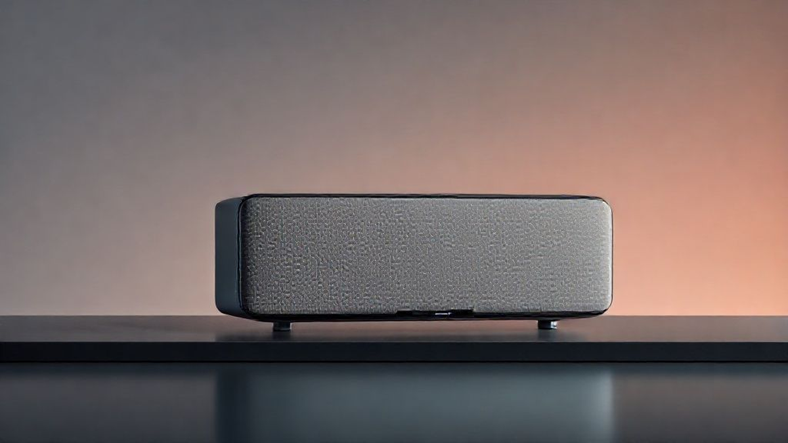

# 내 방을 공연장 첫 줄로 만드는 마법, 스피커 이야기

최고의 **스피커**를 찾는 여정은 단순히 좋은 소리를 찾는 것을 넘어, 음악과 나 사이의 교감을 극대화하는 과정이라고 생각해요. 저는 자칭 '공연장 붙박이'이자, 헤드폰보다는 온몸으로 공간을 울리는 소리를 사랑하는 라이브 애호가입니다. 스탠딩석 맨 앞에서 땀 흘리며 느꼈던 베이스의 진동, 앙코르 마지막 곡이 끝나고 공연장을 가득 채우던 공기의 떨림. 그 감동을 집에서도 조금이나마 재현하고 싶다는 열망이 저를 스피커의 세계로 이끌었죠. 처음에는 그저 스마트폰에 연결하는 작은 블루투스 스피커로 시작했어요. '이 정도면 충분하지'라고 생각했지만, 어느 날 라디오헤드의 <OK Computer> 앨범을 듣다가 깨달았어요. 톰 요크의 목소리는 들리지만, 그를 감싸는 공간의 질감, 기타 이펙터의 미묘한 잔향, 필 셀웨이의 드럼 탐 소리가 서로 엉켜 뭉개지는 걸요. 이건 내가 공연장에서, 그리고 좋은 헤드폰으로 들었던 그 소리가 아니었어요. 마치 그림의 해상도가 낮아져 디테일이 모두 뭉개진 느낌이었죠. 그때부터였어요. 제 방을 아티스트의 녹음실, 혹은 나만을 위한 작은 공연장으로 만들기 위한 길고 긴, 그리고 때로는 실패로 가득했던 여정이 시작된 겁니다. 이 글은 스펙과 가격표만 나열하는 딱딱한 가이드가 아니에요. 음악을 사랑하는 한 사람이 직접 부딪히고 깨달으며 찾아낸, 진짜 '내 소리'를 찾는 여정에 대한 솔직한 기록입니다.

## 스피커, 그냥 '소리 나는 상자'가 아니라고?

많은 분들이 스피커를 고를 때 크기나 디자인, 혹은 가격만 보고 결정하는 경우가 많아요. 저도 그랬으니까요. 제 첫 '본격적인' 스피커는 20만 원대 북쉘프 스피커였는데, 매장에서 들었을 땐 꽤 그럴듯하게 들렸거든요. 하지만 집에 와서 설치하니 소리가 답답하고 저음은 부풀어서 벙벙거렸죠. 마치 목도리를 두르고 노래하는 가수를 듣는 기분이랄까요. 그때 깨달았어요. 스피커의 기본 원리조차 모르고 덤볐다는 걸요. 실패는 최고의 스승이라고 하잖아요? 그때부터 저는 스피커의 '속'을 들여다보기 시작했습니다.

가장 먼저 마주한 개념은 **액티브 스피커**와 **패시브 스피커**였어요. 처음엔 무슨 말인가 싶었죠. 쉽게 설명하자면, 액티브 스피커는 스피커 안에 앰프(소리를 증폭시켜주는 장치)가 내장된 '올인원' 제품이에요. 전원 코드만 꽂고 소스 기기(스마트폰, PC 등)를 연결하면 바로 소리가 나죠. 요즘 나오는 대부분의 블루투스 스피커나 PC 스피커, 그리고 전문가들이 녹음실에서 쓰는 '모니터링 스피커'들이 여기에 속해요. 제네렉(Genelec)이나 KEF의 LS 시리즈 같은 제품들이 대표적이죠. 편리함이 최대 장점이라 입문자에게 정말 좋아요.

반면, 패시브 스피커는 앰프가 따로 필요해요. 스피커는 순수하게 소리를 내는 역할만 하고, 소리 증폭은 별도의 인티앰프나 리시버가 담당하죠. 그래서 스피커, 앰프, 소스 기기를 각각 연결해야 하는 번거로움이 있어요. 하지만 이게 또 매력이에요. 앰프나 케이블을 바꾸면서 소리의 색깔을 내 취향에 맞게 '튜닝'하는 재미가 있거든요. 저는 액티브 스피커로 시작해서 지금은 패시브 시스템을 사용하고 있는데, 앰프를 바꿨을 때 마치 안개가 걷히듯 소리가 명료해지는 경험은 정말 짜릿했어요.

다음으로 알아야 할 건 스피커의 '얼굴'에 해당하는 **유닛(드라이버)**이에요. 보통 스피커를 보면 크고 작은 동그란 유닛들이 여러 개 달려있죠. 가장 큰 유닛은 **우퍼**라고 불리며 베이스 기타나 킥드럼 같은 낮은 저음을 담당해요. 중간 크기는 **미드레인지**로, 사람의 목소리나 기타, 피아노 같은 중심 멜로디를 책임지죠. 가장 작은 **트위터**는 심벌즈나 하이햇 같은 찰랑거리는 고음을 내고요. 이 유닛들이 각자의 역할에 맞춰 조화롭게 소리를 내는 게 중요해요. 록 음악을 예로 들면, 우퍼는 심장을 때리는 킥드럼을, 미드레인지는 날카로운 기타 리프를, 트위터는 시원하게 터지는 크래쉬 심벌을 표현하는 거죠. 이 중 하나라도 제 역할을 못 하면 음악의 균형이 무너져요. 제가 처음 샀던 스피커는 저가형이라 그런지 우퍼가 저음을 제대로 제어하지 못하고 '벙벙'거리기만 해서 다른 소리들을 다 가려버렸던 거죠.

이와 관련해서 **주파수 응답**이라는 스펙도 중요해요. 보통 '20Hz - 20,000Hz' 이런 식으로 표시되는데, 인간이 들을 수 있는 소리의 범위를 얼마나 잘 재생하는지를 나타내요. 하지만 단순히 숫자가 넓다고 좋은 건 아니에요. 중요한 건 그래프가 얼마나 평탄한가, 즉 '플랫(Flat)'한가예요. 플랫하다는 건 특정 음역대를 과장하거나 축소하지 않고, 아티스트가 녹음실에서 의도한 소리를 가장 정직하게 들려준다는 의미거든요. 물론, 일부러 저음과 고음을 강조해서 더 신나게 들리도록 만든 'V자형' 사운드를 선호하는 분들도 있어요. 이건 취향의 영역이지만, 시작은 가장 정직한 '플랫'한 스피커로 하는 걸 추천해요. 그래야 음악 본연의 소리를 제대로 파악하고, 내 취향이 어떤 소리인지 기준을 잡을 수 있거든요.

## 내 공간과 음악 취향에 딱 맞는 스피커 고르기

스피커의 기본을 조금 알게 되니, 다음 질문이 생기더군요. '그래서 나한테 맞는 스피커는 대체 뭐야?' 세상에는 수많은 브랜드와 모델이 있고, 가격대도 천차만별이니까요. 저는 여기서 또 한 번의 실수를 저지릅니다. 무조건 비싸고 평 좋은 스피커를 사면 해결될 줄 알았어요. 큰맘 먹고 유명 브랜드의 중급 북쉘프 스피커를 들였는데, 이번에도 결과는 실망스러웠습니다. 소리가 나쁜 건 아니었지만, 제 좁은 방을 감당하지 못하고 웅웅거리는 저음에 머리가 아플 지경이었죠. 여기서 저는 가장 중요한 교훈을 얻었습니다. 스피커는 진공상태에서 혼자 소리 내는 기계가 아니라, **'공간'과 함께 호흡하는 악기**라는 사실을요.

### 공간의 크기와 특성을 먼저 파악하세요

가장 먼저 고려해야 할 것은 스피커를 놓을 공간의 크기입니다. 제 3평 남짓한 작은 방에 6.5인치 우퍼를 단 북쉘프 스피커는 과유불급이었던 거죠. 자동차로 비유하자면, 좁은 골목길에서 페라리를 몰려는 것과 같았어요. 작은 방에서는 저음이 벽에 반사되고 중첩되면서 '부밍(Booming)'이라는 공진 현상이 생기기 쉬워요. 이렇게 되면 베이스 라인이 명확하게 들리지 않고 그냥 '웅웅'거리는 소음처럼 변해버리죠. 만약 원룸이나 작은 방에서 음악을 듣는다면, 4~5인치 정도의 우퍼를 가진 **북쉘프 스피커**가 훨씬 좋은 선택이 될 수 있어요. 오히려 작은 공간에서는 더 명료하고 단단한 저음을 들을 수 있죠.

반대로 20평대 이상의 넓은 거실이라면 작은 북쉘프 스피커로는 공간을 채우기 벅찰 수 있어요. 이럴 땐 키가 큰 **플로어스탠딩(톨보이) 스피커**나, 성능 좋은 북쉘프 스피커에 **서브우퍼**를 추가하는 조합을 고려해볼 수 있습니다. 서브우퍼는 초저역만 전담하는 스피커인데, 영화 볼 때만 쓴다고 생각하면 오산이에요. 음악 감상 시에도 공간을 가득 채우는 깊고 풍성한 저음을 더해줘서 라이브 공연장 같은 현장감을 만들어주거든요.

공간의 재질도 중요해요. 딱딱한 벽과 바닥, 큰 유리창이 많은 공간은 소리가 많이 반사되어 날카롭고 어지럽게 들릴 수 있어요. 반대로 카펫, 소파, 커튼, 책이 많은 공간은 소리를 적절히 흡수해서 더 차분하고 정돈된 소리를 들려줍니다. 비싼 스피커를 사기 전에, 러그를 깔거나 두꺼운 커튼을 다는 것만으로도 음질이 드라마틱하게 개선되는 경험을 할 수 있답니다.

### 당신의 플레이리스트가 스피커를 결정합니다

다음은 당신이 주로 듣는 음악 장르입니다. 모든 장르를 완벽하게 소화하는 '만능 스피커'는 사실상 존재하지 않아요. 각 브랜드와 모델마다 고유의 '음색'과 '성향'이 있거든요.

*   **재즈, 클래식, 어쿠스틱 음악 애호가라면:** 악기 하나하나의 질감과 미세한 연주자의 숨소리까지 포착하는 **해상력**과 **정위감**(악기 위치가 정확하게 느껴지는 것)이 좋은 스피커를 추천해요. 보통 영국 브랜드인 B&W(Bowers & Wilkins), KEF, 모니터 오디오(Monitor Audio) 등이 이런 성향으로 유명하죠. 저는 얀 티에르센의 피아노 연주곡을 들을 때, 해머가 현을 때리는 순간의 타격감과 페달을 밟을 때 울리는 미세한 공명까지 잡아내는 스피커를 만났을 때 정말 소름이 돋았어요.
*   **록, 메탈, EDM 팬이라면:** 빠르고 강렬한 비트에도 뭉개지지 않는 **다이내믹스**와 **타격감**이 중요해요. 시원하게 뻗어 나가는 고음과 단단하게 끊어치는 저음이 필수죠. 미국 브랜드인 클립쉬(Klipsch)는 특유의 혼(Horn) 트위터로 시원하고 직진성 강한 사운드를 들려줘서 록 마니아들에게 인기가 많아요. 데프톤즈의 앨범을 볼륨 높여 들을 때, 드럼과 기타 리프가 한 덩어리가 되어 제 가슴을 때리는 그 쾌감은 정말 최고예요.
*   **힙합, R&B, 팝을 즐겨 듣는다면:** 보컬의 질감을 잘 살려주면서도 리듬감을 받쳐주는 **탄탄한 저음**이 매력적인 스피커가 좋아요. 너무 과하지 않으면서도 깊이 있게 내려가는 저음은 음악의 그루브를 살리는 핵심이거든요. 최근에는 다양한 장르를 아우르는 올라운더 성향의 스피커들도 많이 나오고 있으니, 청음샵에서 평소 즐겨 듣는 켄드릭 라마나 프랭크 오션의 곡을 꼭 들어보세요.

### 2025년의 스피커: 연결성이 곧 편의성

마지막으로 최신 트렌드인 **연결성**도 빼놓을 수 없어요. 예전에는 CD 플레이어나 턴테이블을 앰프에 유선으로 연결하는 것이 일반적이었지만, 지금은 스트리밍 시대잖아요. 2025년의 좋은 스피커는 음질만큼이나 얼마나 편리하게 음악에 접근할 수 있는지를 중요하게 생각해요.

*   **와이파이 스트리밍:** 블루투스보다 훨씬 뛰어난 음질을 제공하며, 스포티파이 커넥트(Spotify Connect)나 타이달 커넥트(TIDAL Connect) 같은 기능을 지원하면 스마트폰으로 곡 선택만 하고 재생은 스피커가 알아서 와이파이로 직접 해요. 스마트폰으로 다른 작업을 하거나 전화를 받아도 음악이 끊기지 않죠.
*   **고음질 블루투스 코덱:** 만약 블루투스를 주로 사용한다면, LDAC이나 aptX HD 같은 고음질 코덱을 지원하는지 확인해보세요. 일반적인 SBC 코덱보다 훨씬 많은 데이터량을 전송해서 무선임에도 유선에 가까운 음질을 들려줍니다.
*   **다양한 입력 단자:** TV와 연결할 수 있는 HDMI ARC, PC와 연결하는 USB-C, 턴테이블을 위한 포노(Phono) 단자 등 다양한 기기를 연결할 수 있다면 활용도가 훨씬 높아지겠죠.

결국 스피커 선택은 내 공간, 내 음악 취향, 그리고 내 라이프스타일에 대한 깊은 이해에서 시작돼요. 남들이 좋다는 스피커가 아니라, '나'에게 최고의 경험을 선사할 스피커를 찾는 과정 자체를 즐겨보세요.

## 음질을 결정하는 의외의 요소들: 소스와 배치

큰맘 먹고 내 공간과 취향에 맞는 스피커를 장만했다고 끝이 아닙니다. 사실 진짜 게임은 이제부터 시작이에요. 저는 이걸 모르고 또 한참을 헤맸어요. 분명 좋은 스피커인데, 왜 청음샵에서 들었던 그 '감동적인' 소리가 안 나는 걸까? 스피커는 죄가 없었어요. 문제는 스피커에 '밥'을 주는 **소스**와 스피커를 '앉히는' **자리**에 있었죠. 많은 분들이 간과하지만, 이 두 가지 요소는 스피커 자체의 성능만큼이나 최종적인 음질에 어마어마한 영향을 미칩니다.

### "Garbage in, Garbage out": 소스의 중요성

컴퓨터 공학에 "Garbage in, garbage out"이라는 유명한 말이 있죠. 쓰레기를 넣으면 쓰레기가 나온다는 뜻인데, 오디오 세계에서도 똑같이 적용돼요. 아무리 비싸고 성능 좋은 스피커라도, 재생하는 음원 파일의 품질이 낮으면 절대 좋은 소리를 내줄 수 없어요. 이건 마치 4K UHD TV로 화질이 깨진 저용량 동영상을 보는 것과 같아요.

우리가 가장 흔하게 사용하는 **음원 스트리밍 서비스**부터 살펴볼까요? 예를 들어, 스포티파이의 최고 음질은 320kbps Ogg Vorbis 포맷이에요. 이건 '손실 압축' 음원으로, 사람이 잘 듣지 못하는 영역의 데이터를 삭제해서 파일 용량을 줄인 거죠. 일상적으로 듣기엔 무리가 없지만, 좋은 스피커로 들으면 미세한 공간감이나 고음의 개방감이 답답하게 느껴질 수 있어요. 반면, 타이달(TIDAL)이나 코부즈(Qobuz), 애플 뮤직 등은 CD 음질과 동일하거나 그 이상의 **무손실(Lossless) 및 고해상도(Hi-Res) 음원**을 제공해요. 이건 원본 스튜디오 마스터 음원의 데이터를 거의 그대로 담고 있는, 말하자면 '음향의 RAW 파일' 같은 거예요.

제가 처음 무손실 음원을 제대로 된 시스템으로 들었을 때의 충격은 아직도 잊을 수 없어요. 데미안 라이스의 'The Blower's Daughter'를 듣는데, 도입부의 어쿠스틱 기타 소리에서 손가락이 줄을 스치는 미세한 마찰음, 숨을 들이쉬는 소리까지 너무나 생생하게 들려서 마치 그가 바로 내 앞에서 연주하는 듯한 착각이 들 정도였죠. "이 곡 들으면서 정말 위로받았어요"라는 말이 절로 나왔어요. 아티스트가 녹음실에서 의도했던 감정의 결이 손실 압축 과정에서 얼마나 많이 사라지는지 깨닫는 순간이었습니다. 월 1만 원 정도의 추가 비용으로 얻는 경험치고는 정말 엄청나다고 생각해요. 좋은 스피커를 샀다면, 꼭 무손실 음원 서비스를 경험해보시길 강력히 추천합니다.

소스 기기에 내장된 **DAC(Digital-to-Analog Converter)**의 성능도 중요해요. DAC는 0과 1로 이루어진 디지털 음원 파일을 우리가 들을 수 있는 아날로그 소리 신호로 변환해주는 '번역가' 역할을 해요. 스마트폰이나 노트북에도 기본 DAC가 내장되어 있지만, 성능이 그리 좋지 않은 경우가 많아요. 별도의 외장 DAC를 사용하면 훨씬 더 깨끗하고 정교한 소리를 들을 수 있죠. 비유하자면, 서툰 번역가 대신 원어민 수준의 전문 번역가를 쓰는 것과 같아요.

### 스피커 배치: 10cm가 만드는 기적

자, 이제 좋은 음원까지 준비됐다면 마지막 관문, **배치**가 남았습니다. 이건 돈 한 푼 들이지 않고 음질을 업그레이드할 수 있는 최고의 '무료 튜닝'이에요. 저도 처음엔 '스피커 그냥 책상 양옆에 두면 되는 거 아냐?'라고 생각했지만, 몇 시간 동안 줄자를 들고 이리저리 옮겨본 결과, 단 10cm의 차이가 만들어내는 소리의 변화에 경악했습니다.

가장 기본은 **정삼각형 법칙**이에요. 왼쪽 스피커, 오른쪽 스피커, 그리고 음악을 듣는 내 위치가 정삼각형을 이루도록 배치하는 겁니다. 이렇게 하면 가장 이상적인 스테레오 이미지가 형성되면서, 보컬은 마치 스피커 사이 중앙 허공에 떠 있는 것처럼 들리고 각 악기의 위치가 명확하게 그려지는 '사운드 스테이지'를 경험할 수 있어요.

**벽과의 거리**는 저음의 양과 질을 결정하는 핵심 요소예요. 스피커를 뒷벽이나 옆벽에 너무 가깝게 붙이면 저음이 과도하게 부풀려져 벙벙거리는 소리가 나요. 제 경우, 스피커를 뒷벽에서 약 30cm 정도 떼어놓는 것만으로도 답답했던 저음이 훨씬 단단하고 명료해졌어요. 공간이 허락한다면, 조금씩 스피커를 앞으로 당겨보면서 가장 균형 잡힌 소리를 찾아보세요.

**토인(Toe-in)**, 즉 스피커의 각도를 조절하는 것도 매우 중요해요. 스피커를 정면을 향하게 두는 것보다, 살짝 안쪽으로 틀어서 청취 위치를 향하게 하는 거죠. 토인 각도를 많이 줄수록 소리의 초점이 명확해지고 중고음이 더 선명하게 들리지만, 좌우로 펼쳐지는 공간감은 조금 좁아질 수 있어요. 반대로 각도를 줄이면 공간감은 넓어지지만 소리의 밀도감이 떨어질 수 있고요. 이건 정답이 없어요. 내가 좋아하는 음악을 틀어놓고, 스피커 각도를 1도씩 미세하게 조절해가며 가장 마음에 드는 지점을 찾는 과정 자체가 하나의 즐거움이 될 수 있습니다.

마지막으로 **스피커의 높이**입니다. 고음을 담당하는 트위터가 내 귀 높이와 일직선이 되도록 맞추는 게 이상적이에요. 고음은 직진성이 강해서, 높이가 맞지 않으면 제대로 들리지 않거든요. 스피커 스탠드를 사용하는 게 가장 좋지만, 책이나 요가 블록 같은 걸 받쳐서 높이를 맞춰주는 것만으로도 소리의 선명도가 확 달라지는 걸 느낄 수 있을 거예요.

## 결론: 당신의 음악 여정을 함께할 동반자를 찾아서

지금까지 저의 수많은 시행착오와 경험을 바탕으로 스피커에 대한 이야기를 길게 풀어보았습니다. 돌이켜보면, 최고의 스피커를 찾는 여정은 단순히 가장 비싸거나 성능 좋은 기계를 찾는 과정이 아니었어요. 그것은 내 공간을 이해하고, 내가 사랑하는 음악의 본질에 더 깊이 다가가고, 궁극적으로는 '나'의 취향을 발견하는 즐거운 탐구의 시간이었습니다. 액티브와 패시브의 차이를 배우고, 내 작은 방과 어울리는 크기를 고민하고, 10cm의 배치를 위해 끙끙대던 모든 순간들이 모여 지금의 만족스러운 음악 생활을 만들어주었으니까요.

이 글을 읽는 당신이 스피커 앞에서 더 이상 막막함을 느끼지 않았으면 좋겠습니다. 처음부터 완벽할 필요는 없어요. 가장 중요한 것은 당신이 아끼는 앨범 한 장을 골라, 오늘 알려드린 팁 중 하나라도 시도해보는 것입니다. 스피커를 벽에서 조금 떼어보거나, 정삼각형 배치에 맞춰 앉아보세요. 그리고 눈을 감고 온전히 음악에 집중해보세요. 이전에는 들리지 않았던 베이스 라인의 작은 움직임, 보컬의 미세한 떨림, 희미하게 사라지는 리버브의 잔향이 들리는 순간, 당신은 이미 새로운 음악의 세계로 한 걸음 들어선 것입니다. 여러분의 스피커 여정은 어떤 이야기로 채워지고 있나요? 댓글을 통해 여러분의 경험이나 궁금한 점을 나눠주세요. 함께 이야기하며 더 풍성한 음악의 숲을 거닐 수 있기를 바랍니다.

스피커를 고르고 배치하는 과정은 단순히 좋은 소리를 찾는 것을 넘어, 음악을 더 깊이 이해하고 사랑하게 되는 여정입니다. 복잡한 이론이나 값비싼 장비가 아니라, 당신의 공간과 취향에 귀 기울이는 작은 시도들이 모여 최고의 사운드를 완성하죠.

오늘 당장 좋아하는 음악을 틀고 스피커의 위치를 5cm만 옮겨보세요. 혹은 평소보다 조금 더 볼륨을 높여 들어보세요. 거창한 변화가 아니어도 괜찮습니다. 당신의 작은 호기심과 실천이 어제와는 다른 음악적 감동을 선물할 테니까요.

이 글이 당신의 음악 생활에 즐거운 길잡이가 되었기를 바랍니다. 여러분의 공간을 가득 채우는 소리가 이전보다 훨씬 풍성하고 생생하게 다가올 거예요. 이 작은 변화가 가져다줄 새로운 발견과 감동을 응원하며, 여러분의 멋진 음악 여정에 늘 함께하겠습니다. 지금, 당신의 플레이리스트 첫 곡은 무엇인가요?