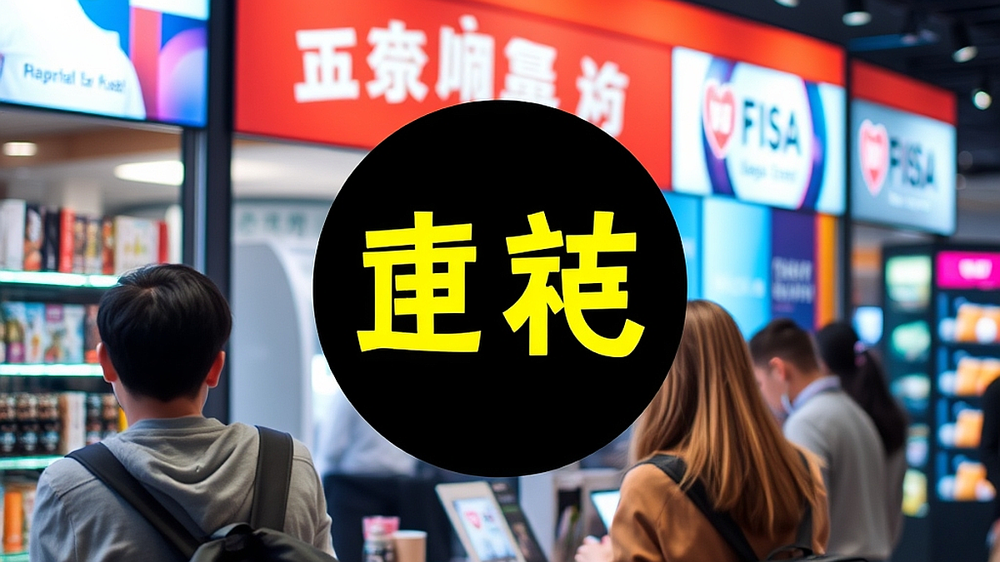

구독 경제의 역습은 이제 우리가 매달 카드 명세서를 보며 느끼는 낯설지 않은 피로감에서 시작됩니다. 2026년의 소비자는 더 이상 단순히 편리하다는 이유만으로 구독 버튼을 누르지 않습니다. 수많은 서비스가 파편화된 일상을 파고들면서, 사람들은 이제 '구독의 피로도'를 계산하기 시작했습니다. 매달 고정 지출이 얼마인지, 그 서비스를 통해 내가 실제로 얻는 효용이 구독료보다 높은지 따져보는 것이 일상이 된 것입니다. 브랜드 입장에서 고객이 내 서비스를 해지하는 이유는 명확합니다. 더 이상 새로운 자극을 주지 못하거나, 고객의 삶 속으로 깊숙이 침투하지 못했기 때문입니다. 이제 구독 비즈니스는 단순히 결제를 자동화하는 단계를 넘어, 고객의 일상 문맥을 읽어내고 그 흐름에 맞는 경험을 제공하는 CRM 전략으로 진화해야 합니다. 할인 쿠폰 몇 장을 뿌려 잠시 해지를 막는 것은 임시방편일 뿐입니다. 진짜 생존은 고객이 나를 잊지 않게 만드는 '관계의 밀도'에 달려 있습니다.

## 고객의 시간을 점유하는 개인화된 타임라인 설계

브랜드가 고객의 구독 해지를 막기 위해 가장 먼저 해야 할 일은 고객의 '시간 소비 패턴'을 파악하는 것입니다. 구독 서비스는 고객의 삶에 일정한 주기로 반복해서 개입합니다. 예를 들어, 매주 식재료를 배송하는 서비스라면 고객이 가장 바쁜 요일이 언제인지, 혹은 어떤 메뉴를 선호하는지 데이터를 통해 읽어내야 합니다. 단순히 배송을 보내는 것이 아니라, 고객이 그 식재료를 요리하는 시간을 '즐거운 루틴'으로 만들어주는 것이 핵심입니다.

실패하는 사례는 대개 일괄적인 메시지 발송에서 나옵니다. 모든 구독자에게 똑같은 날짜, 똑같은 문구로 재결제 알림을 보내는 방식입니다. 이는 고객에게 '돈을 낼 시간'이라는 부정적 인식을 심어줍니다. 반면, 성공적인 브랜드는 고객의 사용 기록을 바탕으로 개인화된 제안을 건넵니다. "지난주에 주문하신 재료로 이런 요리를 해보시는 건 어떨까요?"라며 고객의 다음 행동을 먼저 설계해 주는 것입니다.

선택 기준은 명확합니다. 고객의 과거 행동 데이터가 마케팅 메시지에 얼마나 반영되고 있는가를 보십시오. 만약 브랜드가 보내는 알림이 고객의 최근 사용 맥락과 아무런 관련이 없다면, 고객은 그 즉시 구독을 해지할 명분을 찾게 됩니다. 고객에게 구독은 서비스 이용권이 아니라, 브랜드와 맺은 '약속'입니다. 그 약속이 매달 새롭게 갱신될 가치가 있는지 증명하는 것이 CRM의 본질입니다.

## 실전 체크리스트: 구독 유지력을 높이는 CRM의 3단계

구독 해지를 방어하기 위해 당장 실행해야 할 관리 포인트는 크게 세 가지입니다. 첫째, '해지 신호'를 사전에 포착하는 것입니다. 고객이 최근 3개월간 사용 빈도가 급격히 줄었거나, 특정 기능만 반복적으로 사용하고 있다면 주의가 필요합니다. 둘째, '가치 제안의 전환'입니다. 구독료를 내는 것이 아깝지 않게 만드는 추가 혜택을 제공하되, 단순히 가격을 깎아주는 방식은 피해야 합니다. 가격 할인은 브랜드의 가치를 떨어뜨릴 뿐입니다.

실수하기 쉬운 부분은 해지 프로세스를 지나치게 어렵게 만드는 것입니다. 해지 버튼을 찾기 힘들게 숨겨놓거나, 여러 번의 확인 절차를 거치게 하는 것은 고객의 신뢰를 잃는 가장 빠른 길입니다. 오히려 해지하려는 고객에게 "잠시 쉬어가시겠어요?"라는 휴식 옵션을 제안하거나, 현재의 이용 행태를 분석해 더 적합한 플랜으로 변경하도록 유도하는 것이 훨씬 효과적입니다.

셋째, '커뮤니티와 연결된 소속감'을 부여하는 것입니다. 혼자 사용하는 서비스보다, 같은 브랜드를 구독하는 사람들과 경험을 공유할 때 구독의 가치는 배가 됩니다. 독점 콘텐츠를 제공하거나, 특정 등급 이상의 구독자에게만 열리는 온라인 세미나를 개최하는 방식이 여기에 해당합니다. 단순히 물건이나 서비스를 받는 것을 넘어, 브랜드가 만드는 문화의 일원이 되었다고 느낄 때 고객은 좀처럼 구독을 끊지 않습니다.

## 구독의 가치를 증명하는 데이터 측정과 실험 방법

구독 비즈니스에서 가장 중요한 지표는 단순히 가입자 수가 아닙니다. '유지율(Retention Rate)'과 '고객 생애 가치(LTV)'를 어떻게 높일 것인지가 관건입니다. 이를 위해 필요한 것은 작은 실험입니다. 예를 들어, 특정 고객군을 나누어 A 그룹에는 기존의 결제 알림을 보내고, B 그룹에는 지난달 사용 데이터를 요약한 개인화된 리포트를 보내보는 것입니다. 어떤 그룹의 해지율이 더 낮은지 확인하는 과정이 필요합니다.

실패하는 케이스는 실험의 결과를 해석할 때 '숫자'에만 매몰되는 경우입니다. 단순히 유지율이 올랐다고 해서 그 전략이 정답이라고 단정할 수 없습니다. 고객이 왜 남아있는지에 대한 질적 인터뷰나 사용 후기 분석이 병행되어야 합니다. 숫자는 현상을 보여줄 뿐, 그 뒤에 숨은 고객의 심리는 말해주지 않기 때문입니다.

선택 기준은 다음과 같습니다. 데이터 분석 도구가 단순히 결제 현황만 보여주는지, 아니면 고객의 서비스 이용 경로까지 추적하는지 확인하십시오. 고객이 어떤 페이지에서 망설이는지, 어떤 콘텐츠를 클릭하고 이탈하는지를 볼 수 있어야 구체적인 대응책을 세울 수 있습니다. 유지비 측면에서도, 무분별한 할인보다는 고객의 충성도를 측정하는 지표를 정교하게 만드는 데 비용을 투자하는 것이 장기적으로 훨씬 이득입니다.

## 결론: 구독은 끝이 아니라 관계의 시작입니다

2026년의 구독 경제에서 브랜드가 살아남는 법은 역설적이게도 '고객을 붙잡지 않는 것'에서 시작됩니다. 해지를 쉽게 허용하고, 언제든 돌아올 수 있는 구조를 만드는 브랜드가 오히려 더 높은 충성도를 얻습니다. 고객에게 구독은 선택의 자유가 보장된 상태에서 누리는 즐거움이어야 합니다. 억지로 붙잡아둔 고객은 언젠가 반드시 떠나지만, 브랜드와의 관계가 가치 있다고 느끼는 고객은 스스로 남기를 선택합니다.

지금 바로 여러분의 브랜드가 고객에게 보내는 메시지를 점검해 보십시오. 그 메시지는 고객의 삶을 돕고 있습니까, 아니면 단순히 결제를 독촉하고 있습니까? 고객의 데이터를 단순히 판매 실적을 올리는 도구로 쓰지 말고, 그들이 무엇을 필요로 하는지 이해하는 언어로 바꾸어 보세요. 구독은 단순히 매달 돈을 받는 비즈니스가 아니라, 고객과 브랜드가 매달 새로운 약속을 맺는 과정입니다. 오늘부터 고객의 구독 경험을 다시 설계하고, 그들이 머물러야 할 이유를 매달 새롭게 제시해 보시길 권합니다. 그것이 포화 상태인 시장에서 여러분의 브랜드가 돋보일 수 있는 유일하고도 가장 강력한 전략입니다.

구독 경제의 시대, 단순히 고객을 묶어두는 전략은 더 이상 통하지 않습니다. 이제 브랜드가 집중해야 할 것은 '해지 방어'가 아닌 '가치 증명'입니다. 고객이 구독을 유지하는 이유는 브랜드가 제공하는 지속적인 효용과 신뢰 때문입니다. 고객을 붙잡아두기보다 언제든 떠날 수 있는 자유를 존중할 때, 오히려 고객은 브랜드와의 관계를 더 깊게 신뢰하게 됩니다.

이제 질문을 던져볼 시간입니다. 여러분의 브랜드는 매달 고객의 일상을 어떤 가치로 채우고 있나요? 단순히 결제를 유도하는 알림을 넘어, 고객의 삶에 실질적인 도움을 주는 파트너가 되어보세요. 고객의 데이터를 기반으로 그들이 진정으로 원하는 경험을 설계할 때, 구독은 비로소 일방적인 결제가 아닌 브랜드와 고객의 아름다운 동행이 됩니다.

오늘 바로 구독 여정을 다시 점검해 보세요. 고객이 매달 기꺼이 지갑을 열고, 스스로 머무르기를 선택하게 만드는 힘은 결국 진심 어린 관계 맺기에 있습니다. 여러분의 브랜드가 고객에게 매달 기대되는 설렘으로 기억되길 응원합니다. 지금, 고객의 마음을 얻는 구독 경험을 시작해 보시는 건 어떨까요?
