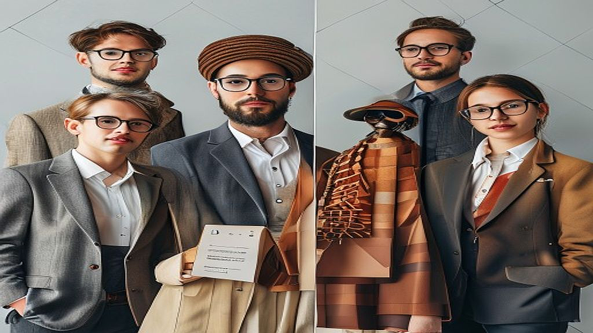

# 구독 경제의 피로도, 2026년 브랜드가 선택한 '멤버십 혜택의 다변화'

구독 경제의 피로도가 임계점에 도달했다는 사실은 이제 마케터들 사이에서 공공연한 비밀이 되었습니다. 매달 통장에서 빠져나가는 자동이체 알람이 반가움이 아닌 '지출 확인'의 성가신 과제가 된 지 오래이기 때문입니다. 저 역시 최근 3개월간 사용하지 않은 OTT 서비스와 영양제 정기 배송을 해지하며 느꼈던 것은, 단순한 물건의 반복 구매가 더 이상 고객을 붙잡아두는 강력한 동기가 되지 않는다는 점입니다. 2026년, 이제 브랜드는 단순히 제품을 정기적으로 배송하는 기능을 넘어, 고객의 소속감과 놀이 욕구를 건드리는 멤버십 혜택의 다변화를 꾀하고 있습니다. 단순히 결제 주기를 관리하는 구독 모델은 이제 한계에 봉착했습니다. 지금부터 우리가 주목해야 할 것은 고객이 브랜드와 어떤 관계를 맺고 싶은지, 그들이 무엇을 '소유'하고 싶은지가 아니라 어떤 '경험'에 참여하고 싶은지입니다. 단순히 목록을 늘리는 구독 모델에서 벗어나, 고객이 스스로 이탈을 거부하게 만드는 멤버십 전략의 핵심을 짚어보겠습니다.

## 첫 번째 전략: 소유가 아닌 '참여'를 파는 커뮤니티 멤버십

구독 서비스의 가장 큰 적은 '관성적 이용'입니다. 매달 배송되는 물건이 쌓이기 시작하면 고객은 가장 먼저 해지 버튼을 찾습니다. 이를 해결하기 위해 최근 성공적인 브랜드들은 제품 배송을 '멤버십의 부수적인 혜택'으로 밀어내고, 커뮤니티 참여권을 핵심 가치로 격상시킵니다. 

예를 들어, 커피 원두를 정기 구독하는 브랜드가 단순히 원두만 보내는 것이 아니라, 멤버들만 접속 가능한 온라인 커핑 세션이나 로스팅 클래스 우선 참여권을 제공하는 방식입니다. 여기서 핵심은 '정보의 비대칭성'을 활용하는 것입니다. 일반 고객은 알 수 없는 원두의 산지 이야기나 브루잉 팁을 멤버십 전용 뉴스레터와 커뮤니티에서 공유할 때, 고객은 단순히 원두를 사는 것이 아니라 '커피를 깊게 즐기는 사람들의 모임'에 참여한다는 효능감을 느낍니다.

실패하는 사례는 명확합니다. 단순히 커뮤니티를 만들고 아무런 운영 가이드 없이 '자유롭게 소통하세요'라고 방치하는 경우입니다. 고객은 광고판이 된 커뮤니티에서 금방 피로를 느끼고 떠납니다. 

선택 기준은 이렇습니다. 우리 브랜드의 제품이 고객에게 '지식'이나 '취향의 척도'가 될 수 있는가? 만약 그렇다면 제품 배송은 멤버십의 50% 이하로 비중을 낮추고, 나머지는 커뮤니티 활동과 연동하세요. 

*   실전 체크리스트: 
    *   멤버십 전용 단톡방이나 게시판이 활성화되어 있는가? 
    *   운영자가 매주 1회 이상 멤버들이 반응할 만한 질문을 던지는가? 
    *   멤버십 등급에 따라 커뮤니티 내 권한이 명확히 차등화되어 있는가?

## 두 번째 전략: 실물 굿즈가 아닌 '희소한 경험' 중심의 멤버십

구독 피로를 유발하는 또 다른 요인은 '재고'입니다. 매달 쌓이는 굿즈나 샘플은 고객의 집 공간을 침범합니다. 2026년 현재, 영리한 브랜드들은 실물 굿즈를 줄이는 대신, 브랜드의 세계관을 경험할 수 있는 오프라인 거점이나 디지털 자산을 제공하는 방향으로 선회하고 있습니다.

예를 들어, 의류 구독 서비스가 매달 옷을 보내주는 대신, 분기별로 브랜드 팝업 스토어의 VIP 입장권이나 브랜드가 협업한 전시회의 도슨트 투어 참여권을 부여하는 식입니다. 이는 고객에게 '나는 이 브랜드의 특별한 일원이다'라는 정체성을 부여합니다. 

실패하는 케이스는 '경험'의 문턱을 지나치게 높게 설정하는 경우입니다. 멤버십 혜택을 쓰기 위해 너무 많은 시간이나 비용을 들여야 한다면 고객은 이를 혜택이 아닌 '숙제'로 인식합니다. 

선택 기준은 '접근성'입니다. 멤버십 혜택을 이용하기 위해 고객이 이동해야 하는 거리가 왕복 1시간 이내인가? 혹은 디지털 환경에서 5분 안에 즉각적인 보상을 받을 수 있는가? 이 조건을 만족하지 못한다면, 오프라인 경험 혜택은 멤버십의 보조 수단으로만 활용해야 합니다.

*   핵심 기준: 
    *   혜택 사용 시 발생하는 추가 비용이 0원인가? (배송비나 입장료 등) 
    *   멤버십 혜택을 사용했을 때 인증샷을 찍어 SNS에 올릴 만한 '거리'가 있는가? 
    *   혜택의 유효기간이 3개월 이상으로 넉넉한가?

## 세 번째 전략: 데이터 기반의 '초개인화' 보상 시스템

결국 구독 서비스의 해지를 막는 것은 '나를 잘 아는 브랜드'라는 느낌입니다. 단순히 매달 같은 시간에 제품을 보내는 것은 시스템의 자동화일 뿐, 고객에게는 감동이 없습니다. 2026년의 멤버십은 고객이 지난달에 무엇을 소비했는지, 어떤 피드백을 남겼는지에 따라 매달 다른 혜택을 큐레이션해 제안합니다.

예를 들어, 지난달에 특정 제품을 유독 빨리 소비했다면 다음 달 멤버십 혜택으로 해당 제품의 용량을 늘려주거나, 반대로 사용하지 않은 제품이 있다면 다음 달에는 다른 제품으로 샘플을 변경할 수 있는 선택권을 주는 식입니다. 이는 '내가 관리받고 있다'는 느낌을 주어 구독 서비스의 가치를 높입니다.

실패하는 케이스는 과도한 데이터 수집입니다. 고객이 원하지 않는 정보까지 지나치게 세밀하게 묻고 이를 혜택에 반영하려 하면, 고객은 프라이버시 침해를 느끼고 즉시 구독을 끊습니다. 

선택 기준은 '투명성'입니다. 고객이 자신의 데이터를 브랜드가 어떻게 활용하고 있는지, 그 대가로 어떤 혜택을 받고 있는지 명확히 인지하고 있는가? 데이터 수집의 목적이 오직 '고객의 편의성 개선'에 한정되어 있다면 성공할 확률이 높습니다.

*   실수하기 쉬운 부분: 
    *   데이터 분석 결과를 브랜드의 마케팅 용도로만 사용하는 경우 
    *   고객의 피드백을 반영하는 과정이 너무 복잡하여 3단계 이상의 클릭이 필요한 경우 
    *   개인화 제안이 너무 잦아 '스팸'처럼 느껴지는 경우

## 결론: 지속 가능한 멤버십을 위한 마케터의 태도

구독 경제의 피로도를 낮추는 핵심은 '정기 결제'라는 비즈니스 모델을 '관계 맺기'라는 브랜딩의 영역으로 가져오는 데 있습니다. 2026년의 소비자는 더 이상 단순한 물건의 반복 구매를 위해 멤버십을 유지하지 않습니다. 그들은 자신이 속한 커뮤니티의 수준, 브랜드가 제공하는 독특한 경험, 그리고 나를 진심으로 이해하고 있다고 느껴지는 개인화된 배려를 기준으로 구독을 지속할지 결정합니다.

지금 당장 여러분의 멤버십 서비스를 점검해 보십시오. 고객이 '해지' 버튼을 누르려 할 때, 그들이 망설이게 만드는 '커뮤니티적 가치'가 서비스 안에 녹아 있습니까? 단순히 할인율을 높이거나 굿즈를 추가하는 방식은 이제 임시방편일 뿐입니다. 고객의 시간을 점유하고, 그들의 취향을 존중하며, 브랜드와 함께 성장한다는 감각을 심어주는 것, 그것이 2026년 브랜드가 취해야 할 멤버십 다변화의 정답입니다. 오늘부터 고객의 피드백을 단지 데이터로 보지 말고, 그들이 우리 브랜드와 어떤 이야기를 나누고 싶어 하는지, 그 맥락을 읽어내는 노력을 시작하시기 바랍니다. 브랜드의 성장은 고객이 결제 버튼을 누르는 순간이 아니라, 결제 이후의 경험을 즐거워할 때 비로소 완성됩니다.

결국 2026년의 구독 경제는 단순한 ‘상품의 반복 구매’를 넘어 ‘관계의 깊이’를 파는 비즈니스로 진화하고 있습니다. 고객은 이제 할인 혜택보다 자신을 이해해 주는 브랜드의 세심한 배려와 소속감에 더 큰 가치를 둡니다. 멤버십이 단순히 결제 수단으로 남느냐, 아니면 고객의 일상에 스며든 특별한 경험이 되느냐는 바로 여기서 갈릴 것입니다.

이제는 변화가 필요한 시점입니다. 여러분의 멤버십이 고객에게 어떤 ‘커뮤니티적 가치’를 주고 있는지 다시 한번 점검해 보세요. 단순히 혜택을 늘리는 대신, 고객의 취향을 깊이 있게 이해하고 그들과 지속적인 대화를 나누는 브랜드만이 치열한 구독 피로도 속에서 살아남을 수 있습니다.

오늘부터 고객의 데이터를 넘어 그들의 맥락과 취향을 읽어보는 것은 어떨까요? 고객이 결제 버튼을 누르는 순간을 넘어, 브랜드와 함께 성장하는 즐거움을 선물해 보세요. 여러분의 브랜드가 고객의 일상 속에서 대체 불가능한 동반자로 자리 잡기를 진심으로 응원합니다. 지금 바로, 고객과의 진정한 연결을 시작해 보세요!
