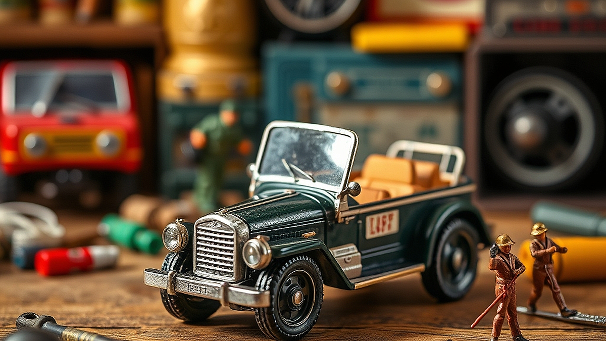

## 빈티지 토이의 재발견: 2026년, 당근마켓에서 보물 찾기

빈티지 토이를 수집하는 일은 단순히 낡은 플라스틱 덩어리를 모으는 행위가 아닙니다. 지금 우리 곁의 빈티지 토이 수집은 2026년 현재, 디지털 피로에 지친 3040 세대가 자신의 정체성을 물리적인 공간에 투영하는 가장 확실한 방식이 되었습니다. 흔히들 이를 추억팔이라 치부하지만, 실상은 다릅니다. 우리는 어린 시절 가질 수 없었던, 혹은 잃어버렸던 그 물건을 성인이 된 지금의 경제력으로 다시 소유함으로써 과거의 나를 위로하고 현재의 공간을 취향으로 채우는 재구성의 과정을 거치고 있습니다. 당근마켓과 같은 지역 기반 중고 거래 플랫폼이 활성화되면서, 이제 빈티지 토이는 전문가의 전유물이 아니라 누구나 일상 속에서 시작할 수 있는 취미가 되었습니다. 하지만 이 시장은 정보의 비대칭성이 크고, 가품이나 상태 불량 제품이 섞여 있어 신중한 접근이 필요합니다. 오늘은 30대 직장인이자 5년 차 수집가로서, 실패 없는 빈티지 토이 입문을 위해 꼭 알아야 할 실전 가이드를 정리했습니다. 단순히 예쁜 것을 고르는 단계를 넘어, 가치 있는 수집을 지속하기 위한 판단 기준과 중고 거래의 위험 요소를 피하는 구체적인 전략을 다룹니다.

## 가치 있는 빈티지 토이를 판별하는 3가지 기준

빈티지 토이를 고를 때 가장 먼저 마주하는 고민은 '이게 정말 가치가 있는가'입니다. 단순히 오래되었다고 해서 모두 가치가 있는 것은 아니며, 재테크 목적으로 접근하면 십중팔구 실망하게 됩니다. 제가 수집을 시작할 때 세운 첫 번째 원칙은 '대체 불가능한 서사'입니다. 

첫째, **오리지널 패키지의 유무와 상태**입니다. 박스가 포함된 제품은 그렇지 않은 제품보다 가격이 2~3배 높게 형성되지만, 그만큼 보존 가치가 큽니다. 특히 90년대 애니메이션 캐릭터 피규어는 박스에 인쇄된 당시의 타이포그래피와 아트워크 자체가 시대의 기록입니다. 실패 사례를 하나 들자면, 3년 전 상태가 매우 깨끗해 보이는 90년대 로봇 완구를 박스 없이 덜컥 샀는데, 나중에 알고 보니 특정 부속품이 결합된 사제 복제품이었습니다. 이 경험 이후 저는 '박스 없는 제품은 50% 이상의 할인율이 적용되지 않으면 사지 않는다'는 기준을 세웠습니다.

둘째, **관절과 도색의 상태**입니다. 빈티지 토이는 플라스틱의 재질 특성상 시간이 지나면 가소제가 빠져나가 끈적이는 '끈적임 현상'이 발생합니다. 이는 세척으로 해결될 수 있는 수준인지, 아니면 소재 자체가 부식되고 있는지를 확인해야 합니다. 

셋째, **커뮤니티 내의 레퍼런스 존재 여부**입니다. 아무리 희귀해 보여도 구글이나 전문 수집 커뮤니티에서 동일 모델의 사례를 찾을 수 없다면, 그것은 시장성이 없는 제품이거나 가품일 확률이 높습니다. 선택 기준은 간단합니다. '내가 이 물건을 5년 뒤에도 내 책상 위에 두고 싶을 만큼 설레는가'입니다. 만약 투자가 목적이라면 빈티지 토이는 최악의 선택지입니다. 유지비로 세척제, 보관용 아크릴 케이스, 제습제 비용이 꾸준히 발생하기 때문입니다.

## 실전 체크리스트: 당근마켓 거래에서 살아남기

중고 거래 플랫폼에서 빈티지 토이를 구할 때 가장 큰 걸림돌은 사기와 가품입니다. 특히 사진으로만 상태를 확인해야 하는 경우, 판매자가 의도적으로 흠집을 가리는 경우가 많습니다. 저는 직거래를 원칙으로 하되, 택배 거래를 할 때는 반드시 다음의 체크리스트를 실행합니다.

**실전 체크리스트**
1. **상세 사진 요청의 디테일**: 전체 샷은 의미 없습니다. 관절의 연결 부위, 도색이 벗겨지기 쉬운 모서리, 그리고 제조사 로고가 각인된 바닥 면 사진을 반드시 요구하십시오.
2. **끈적임 테스트 영상**: 판매자에게 손가락으로 가볍게 문지르는 영상을 찍어달라고 요청하세요. 이 요청을 거부하는 판매자는 피하는 것이 좋습니다.
3. **가격 산정의 근거**: 당근마켓에서 지나치게 저렴한 물건은 대부분 하자품입니다. '시세보다 30% 저렴하다'면 반드시 하자가 있다고 가정하고 접근하십시오.
4. **수리 이력 확인**: 본드 자국이나 변색 제거를 위한 약품 사용 여부를 물어보세요. 잘못된 세척은 플라스틱 표면을 영구적으로 손상시킵니다.

실패 사례로, 과거에 아주 저렴하게 나온 80년대 캐릭터 인형을 샀다가 내부의 솜이 썩어 곰팡이 냄새가 진동해 버린 적이 있습니다. 사진으로는 알 수 없는 냄새와 같은 '보이지 않는 하자'가 빈티지 토이의 가장 큰 복병입니다. 따라서 빈티지 토이는 가급적 직접 눈으로 확인하고 냄새를 맡아볼 수 있는 직거래를 권장합니다. 처음 시작할 때는 10만 원 미만의 단품부터 시작하여, 본인의 수집 공간(책장 한 칸 정도)에 맞는 크기의 제품만 고집하는 것이 공간 관리와 비용 통제 측면에서 유리합니다.

## 수집의 지속 가능성: 공간과 유지보수

빈티지 토이를 수집하면 필연적으로 '공간 부족'과 '관리'라는 숙제에 직면합니다. 20대 후반에서 40대까지의 키덜트에게 집은 휴식의 공간이어야 하는데, 장난감이 짐처럼 쌓이면 스트레스가 됩니다. 저는 수집품을 전시할 때 '순환 구조'를 만듭니다. 새로운 물건을 하나 사면, 기존의 것 중 애정이 식은 하나를 정리하여 자금을 확보하고 공간을 비우는 방식입니다. 이렇게 하면 유지비가 감당 가능한 수준으로 관리됩니다.

유지보수 측면에서 가장 중요한 것은 '빛'과 '습기' 차단입니다. 직사광선이 닿는 곳에 피규어를 두면 1년도 채 되지 않아 도색이 변색됩니다. 이를 막기 위해 자외선 차단 필름을 창문에 붙이거나, 장식장 내부에 LED 조명을 설치할 때는 반드시 발열이 적은 제품을 선택해야 합니다. 

피해야 할 경우는 '전체 라인업을 다 모으겠다는 강박'입니다. 모든 시리즈를 다 모으려 하면 수집은 노동이 됩니다. 대신 본인이 가장 좋아하는 캐릭터나 특정 연도에 출시된 제품군 하나만 정해서 '큐레이션'하는 방식으로 접근하십시오. 처음 시작할 때는 거창한 장식장보다는, 다이소에서 판매하는 투명 아크릴 케이스를 활용해 소중한 아이템 3개만 먼저 전시해보는 것을 추천합니다. 1인당 적정 수집 규모는 본인의 책상 면적을 넘지 않는 것이 좋습니다. 이를 넘어서면 수집이 아니라 수납의 영역으로 넘어가며, 관리가 소홀해져 결국 방치하게 됩니다. 빈티지 토이는 관리하는 시간만큼만 우리에게 즐거움을 돌려줍니다.

## 결론: 당신만의 작은 박물관을 만들기 위해

빈티지 토이 수집은 과거의 조각을 현재의 삶으로 가져와 배치하는 창조적인 행위입니다. 당근마켓에서 보물을 찾는 과정은 단순한 소비를 넘어, 내가 무엇을 좋아하고 어떤 가치를 중요하게 생각하는지 깨닫는 시간입니다. 오늘 제시한 판별 기준과 체크리스트를 활용해, 무분별한 수집 대신 나만의 취향이 담긴 작은 박물관을 시작해보시기 바랍니다. 

기억하십시오. 가장 가치 있는 장난감은 남들에게 비싸게 팔리는 물건이 아니라, 당신이 퇴근 후 지친 몸으로 집에 돌아와 그 물건을 바라볼 때 미소 짓게 만드는 바로 그 물건입니다. 지금 바로 당근마켓 검색창에 어린 시절 가장 좋아했던 캐릭터 이름을 입력해보세요. 다만, 지나친 욕심은 금물입니다. 처음에는 딱 하나, 정말 마음에 드는 제품 하나를 신중하게 고르는 것부터 시작하십시오. 당신의 공간이 단순한 주거지를 넘어 취향의 안식처로 변하는 경험을 하시길 응원합니다. 오늘 바로 그 첫 번째 보물을 찾아 나설 준비가 되셨나요?

빈티지 토이 수집은 단순히 오래된 물건을 모으는 것이 아니라, 잊고 지냈던 어린 시절의 감성을 현재의 일상으로 불러오는 특별한 여정입니다. 오늘 살펴본 판별 기준과 체크리스트가 여러분의 현명한 수집 생활에 작은 이정표가 되었기를 바랍니다. 수집의 진정한 가치는 가격표가 아닌, 퇴근길 지친 마음을 위로해 줄 당신만의 '미소'에 있다는 사실을 꼭 기억해 주세요.

이제 여러분의 차례입니다. 지금 바로 당근마켓 검색창을 열어 오래전 아꼈던 캐릭터의 이름을 입력해보는 건 어떨까요? 처음부터 완벽한 컬렉션을 꾸리려 애쓰기보다는, 진심으로 설레는 단 하나의 보물을 찾는 것부터 시작해보세요. 작은 장난감 하나가 여러분의 공간을 취향 가득한 안식처로 바꾸어 줄 것입니다. 오늘, 여러분의 마음을 설레게 할 첫 번째 보물을 꼭 만나시길 응원합니다! 어떤 보물을 발견하셨는지, 나중에 꼭 들려주세요.
