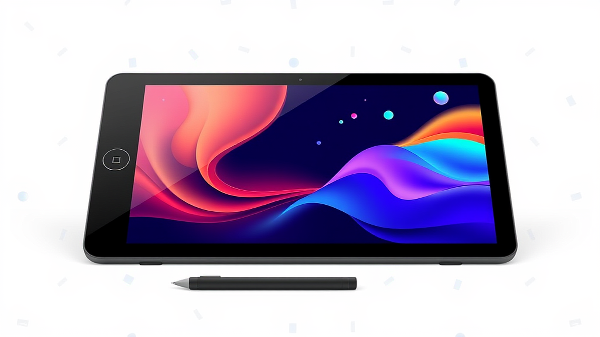
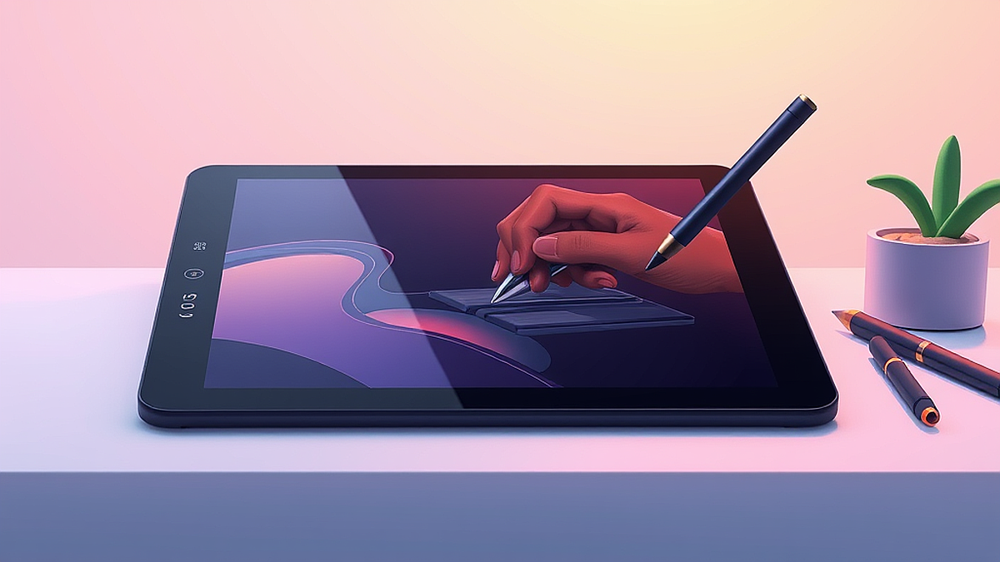

웹툰 작가 지망생을 위한 입문용 장비 추천 및 클립스튜디오 활용법을 고민하고 계시군요. 처음 웹툰을 시작하려는 분들이 가장 많이 겪는 시행착오가 바로 '장비 욕심'입니다. 저 역시 처음 웹툰을 그리겠다고 마음먹었을 때, 프로 작가들이 사용하는 수백만 원대 액정 타블렛을 사야만 그림이 잘 그려질 줄 알았습니다. 하지만 현실은 달랐죠. 좁은 자취방 책상 위에서 거대한 액정 타블렛은 짐만 되었고, 정작 중요한 것은 장비의 가격이 아니라 내 손에 익은 도구와 작업 환경을 조성하는 능력이었습니다. 이번 글에서는 좁은 공간에서 시작하는 예산 50만 원 미만의 입문자를 기준으로, 정말 필요한 장비와 클립스튜디오 활용법을 정리해 드립니다.

## 입문자를 위한 타블렛 선택 기준: 판타블렛인가, 액정 타블렛인가

많은 지망생이 액정 타블렛을 선호하지만, 예산이 50만 원 이하라면 저는 단호하게 '판타블렛'을 권합니다. 액정 타블렛은 모니터 화면에 직접 그리는 방식이라 직관적이지만, 저가형 제품은 발열이 심하고 색감 왜곡이 잦습니다. 반면 와콤의 인튜어스나 인튜어스 프로 같은 판타블렛은 내구성이 검증되어 있고, 책상 공간을 매우 적게 차지합니다.

실제 사례로 제 지인은 무리해서 저가형 13인치 액정 타블렛을 샀다가, 1년도 안 되어 화면 불량으로 고생했습니다. 반면 저는 10년 전 구매한 판타블렛을 지금도 서브 장비로 쓰고 있죠. 실패 케이스는 '화면이 보여야 그림이 늘 것 같다'는 막연한 불안감에 예산을 무리하게 배정하는 것입니다. 판타블렛은 처음에는 손과 눈이 따로 노는 이질감이 들지만, 2주 정도만 매일 1시간씩 선 긋기 연습을 하면 금방 적응합니다.

선택 기준은 명확합니다. 책상 가로 폭이 80cm 미만이거나, 예산이 30만 원 이하인가요? 그렇다면 무조건 판타블렛 중형 모델을 선택하세요. 브랜드는 와콤의 보급형 라인이나, 최근 가성비로 주목받는 엑스피펜(XP-PEN)의 데코 시리즈 정도면 충분합니다. 펜의 필압 감지 단계가 8192레벨 이상인지, 펜에 충전이 필요 없는 무충전 방식인지 딱 두 가지만 확인하면 실패할 확률이 거의 없습니다. 무충전 펜은 배터리 교체 스트레스가 없어 작업 흐름을 끊지 않기 때문입니다.

## 클립스튜디오 활용법: 첫 시작은 단축키와 브러시 세팅부터

클립스튜디오는 웹툰 제작의 표준 도구입니다. 처음 프로그램을 켜면 복잡한 인터페이스에 압도당하기 쉽습니다. 하지만 겁먹을 필요 없습니다. 입문자가 꼭 알아야 할 핵심은 '단축키 커스텀'과 '소재 활용'입니다. 저는 처음에 기본 단축키를 그대로 썼는데, 왼손 위치가 불편해 속도가 나지 않았습니다. 나중에 자주 쓰는 도구인 펜, 지우개, 올가미 툴을 왼손 근처에 배치하고 나니 작업 속도가 2배는 빨라졌습니다.

실패 케이스는 처음부터 너무 많은 기능을 익히려는 것입니다. 레이어 마스크, 벡터 레이어, 3D 모델링 등 고급 기능을 공부하다 보면 정작 그림은 한 장도 완성하지 못하게 됩니다. 대신 '벡터 레이어' 하나만 제대로 활용해 보세요. 벡터 레이어는 선을 그린 뒤에도 모양을 수정할 수 있어, 웹툰의 복잡한 선화를 그릴 때 수정 시간을 획기적으로 줄여줍니다.

실전 체크리스트를 하나 드립니다. 첫째, [파일] - [단축키 설정]에서 자주 쓰는 툴을 단축키 1개로 지정했는가? 둘째, 클립스튜디오 에셋(Assets)에서 무료로 배포하는 'G펜' 브러시 중 나와 가장 잘 맞는 것을 하나 골랐는가? 셋째, 캔버스 설정 시 해상도는 300~350dpi로 고정했는가? 이 세 가지만 지켜도 기초 환경은 완벽합니다. 특히 해상도를 낮게 설정하면 나중에 인쇄하거나 웹에 올릴 때 화질이 깨지니, 시작할 때 반드시 확인해야 합니다.

## 웹툰 제작 효율을 높이는 작업 환경과 유지비 관리

장비가 갖춰졌다면 이제 지속 가능한 작업 환경을 만들어야 합니다. 웹툰은 단거리 달리기가 아니라 마라톤입니다. 매일 앉아 있는 의자와 모니터 높이가 중요합니다. 저는 처음 1년 동안 낮은 의자에서 구부정하게 작업하다가 거북목 증후군으로 고생했습니다. 장비에 50만 원을 썼다면, 최소한 모니터 받침대나 허리를 지지해 줄 쿠션에는 3만 원 정도 투자하세요.

실패 케이스는 매달 나가는 유지비를 간과하는 것입니다. 클립스튜디오는 구독형 요금제와 일시불 구매 방식이 섞여 있는데, 자신의 작업 빈도를 따져봐야 합니다. 매일 작업한다면 일시불 구매가 장기적으로 이득이지만, 가끔 그리는 취미 수준이라면 월간 구독이 경제적입니다. 또한, 타블렛 펜심은 소모품입니다. 펜심이 닳은 줄 모르고 계속 쓰면 타블렛 표면이 긁혀서 장비 수명이 줄어듭니다. 펜심은 넉넉히 10개들이 팩을 미리 사두는 것이 정신 건강에 좋습니다.

판단 기준은 '작업의 연속성'입니다. 내가 일주일에 3일 이상, 하루 2시간씩 꾸준히 그릴 환경이 되는지 확인하세요. 만약 공간이 좁아 매번 장비를 치워야 한다면, 판타블렛은 책상 구석에 세워두고 펜만 파우치에 넣으면 되니 매우 효율적입니다. 반면 액정 타블렛은 연결 선이 많아 매번 설치하는 것 자체가 스트레스가 되어 결국 그림을 안 그리게 되는 상황이 옵니다. 자신의 성향이 '정리 정돈형'인지, '다 펼쳐놓는 형'인지에 따라 장비 선택을 달리해야 합니다.

## 핵심 기준 및 실전 체크리스트

웹툰 지망생으로서 장비를 고를 때 가장 중요한 원칙은 '내 실력을 가리지 않는 장비'를 선택하는 것입니다. 비싼 장비는 더 정교한 기능을 제공하지만, 결국 선을 긋는 것은 작가의 손입니다. 제가 사용해 본 결과, 10만 원대 판타블렛으로도 충분히 프로급 원고를 만들어낼 수 있습니다. 오히려 장비에 돈을 너무 많이 쓰면, 본전 생각이 나서 그림을 즐기지 못하고 압박감을 느끼게 됩니다.

실전 체크리스트를 다시 정리해 드립니다. 1. 책상 공간은 충분한가? (좁다면 판타블렛), 2. 무충전 펜인가? (필수), 3. 클립스튜디오 벡터 레이어 기능을 익혔는가? (작업 효율의 핵심), 4. 모니터 높이는 눈높이와 맞는가? (건강 유지). 이 기준들을 통과했다면 당신은 이미 장비 준비를 마친 셈입니다. 장비가 부족해서 그림을 못 그린다는 핑계는 이제 사라졌습니다.

이제 남은 것은 매일 꾸준히 그리는 습관뿐입니다. 처음에는 선이 삐뚤빼뚤해도 괜찮습니다. 저도 처음에는 펜선을 긋는 것조차 어려워 며칠을 헤맸습니다. 하지만 클립스튜디오의 '손떨림 보정' 기능을 적절히 활용하고, 내가 그린 선을 하나씩 수정해 나가다 보면 어느새 나만의 그림체가 잡히기 시작할 겁니다. 너무 완벽하게 하려고 하지 마세요. 일단 한 페이지를 완성해 보는 경험이 어떤 비싼 장비보다 여러분의 실력을 키워줄 것입니다. 오늘 바로 클립스튜디오를 켜고, 흰 캔버스에 선 하나를 긋는 것부터 시작해 보세요. 그 작은 한 걸음이 여러분의 웹툰 작가 데뷔를 향한 가장 확실한 길입니다.

## 마치며

지금까지 웹툰 작가 지망생을 위한 필수 입문 장비 선택 기준과 클립스튜디오의 핵심 활용 팁을 상세히 살펴보았습니다. 요약하자면, 자신의 작업 스타일에 맞는 타블렛 선택, 손목과 목의 건강을 지키는 올바른 작업 환경 조성, 그리고 작업 효율을 비약적으로 높여줄 클립스튜디오의 벡터 레이어 기능을 익히는 것이 무엇보다 중요합니다. 비싼 고성능 장비가 실력을 대신해주지는 않지만, 나에게 최적화된 도구는 창작의 즐거움을 더해주고 꾸준히 그릴 수 있는 든든한 버팀목이 되어줄 것입니다.

이제 모든 준비는 끝났습니다. 더 이상 장비 사양을 비교하며 고민하기보다는, 지금 바로 클립스튜디오를 실행해 여러분의 머릿속에만 머물던 이야기를 흰 캔버스 위에 그려보시길 권합니다. 처음에는 선 하나 긋는 것도 어색하고 결과물이 마음에 들지 않을 수 있습니다. 하지만 그 서툰 과정이야말로 프로 작가로 거듭나기 위해 반드시 거쳐야 할 소중한 계단입니다. 오늘 당장 첫 번째 컷의 스케치를 시작해보는 것은 어떨까요?

여러분의 창작 여정은 이제 막 시작되었습니다. 장비는 그 길을 돕는 조력자일 뿐, 결국 작품에 생명력을 불어넣는 것은 여러분의 멈추지 않는 열정과 꾸준한 손길입니다. 여러분의 꿈이 멋진 웹툰으로 탄생하여 수많은 독자들과 만나는 그날까지 저도 진심으로 응원하겠습니다. 다음 포스팅에서도 창작 활동에 실질적인 도움이 되는 유익한 정보와 팁으로 찾아뵙겠습니다. 여러분의 멋진 작가 데뷔를 기원합니다!
