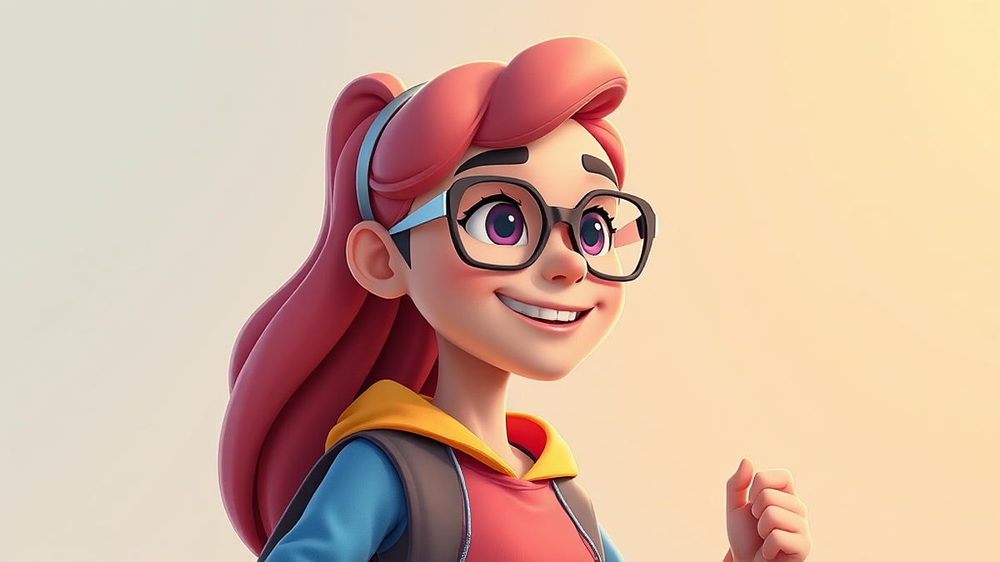

웹툰 속 세상이 모니터를 넘어 내 책상 위로 내려앉는 순간의 설렘을 기억하시나요? 예전에는 단순히 좋아하는 작품을 유료 결제해서 미리 보는 정도에 그쳤다면, 이제는 그 감동을 실물로 소장하려는 덕질 문화가 완전히 자리를 잡았습니다. 저 역시 매주 업데이트되는 회차를 기다리며 가슴 졸이던 팬으로서, 어느덧 방 한구석을 좋아하는 캐릭터의 아크릴 스탠드와 단행본으로 가득 채운 굿즈 수집가가 되었네요. 최근에는 네이버웹툰이나 카카오페이지 같은 대형 플랫폼들이 팝업스토어를 활발하게 열면서, 온라인으로만 보던 캐릭터를 오프라인에서 직접 만나는 경험이 하나의 놀이 문화가 되었습니다. 하지만 쏟아지는 신상 굿즈와 한정판 소식 속에서 중심을 잡지 못하면 지갑은 가벼워지고 방은 발 디딜 틈 없는 창고가 되기 일쑤입니다. 오늘은 제가 수년간 시행착오를 겪으며 터득한 웹툰 굿즈 수집의 노하우와 현명한 소비를 위한 가이드를 공유해 보려고 합니다.

## 화면 밖으로 나온 이야기, 웹툰 굿즈의 진화와 크라우드 펀딩의 매력

불과 몇 년 전까지만 해도 웹툰 관련 상품이라고 하면 단순한 메모지나 스티커 정도가 전부였던 시절이 있었습니다. 하지만 최근의 흐름은 완전히 달라졌습니다. 작품의 세계관을 그대로 녹여낸 향수, 주인공이 입었던 옷을 재현한 의류, 심지어는 고가의 피규어까지 출시되고 있죠. 이런 변화의 중심에는 텀블벅이나 와디즈 같은 크라우드 펀딩 플랫폼이 있습니다. 제작사 입장에서는 수요를 미리 파악할 수 있어 재고 부담을 줄일 수 있고, 팬들 입장에서는 시중에서 보기 힘든 고퀄리티의 한정판 구성을 손에 넣을 수 있다는 장점이 있습니다. 저도 처음에는 펀딩이라는 형식이 낯설어 망설였지만, '데뷔 못 하면 죽는 병 걸림'이나 '화산귀환' 같은 대작들의 펀딩 성공 사례를 보며 그 열기에 동참하게 되었습니다.

펀딩의 가장 큰 매력은 독자와 작가가 함께 무언가를 만들어간다는 유대감에 있습니다. 목표 금액이 달성될 때마다 추가되는 리워드(보상)를 확인하는 재미가 쏠쏠하거든요. 하지만 여기서 주의할 점이 있습니다. 펀딩은 일반 쇼핑몰처럼 바로 배송되는 시스템이 아닙니다. 짧게는 3개월에서 길게는 1년 가까이 기다려야 하는 경우도 허다하죠. 저는 예전에 한 로맨스 판타지 작품의 화려한 일러스트에 반해 덜컥 펀딩에 참여했다가, 제품을 받을 때쯤에는 이미 그 작품에 대한 열정이 식어버려 처치 곤란이 된 경험이 있습니다. 이른바 식어버린 팬심과 마주하는 순간이죠. 그래서 펀딩에 참여할 때는 단순히 지금 당장의 기분보다는, 내가 이 작품을 오랫동안 간직할 만큼 진심인지 스스로에게 되물어보는 과정이 반드시 필요합니다.

또한 펀딩 상세 페이지의 화려한 렌더링 이미지와 실제 제품의 퀄리티 사이에는 간극이 존재할 수 있습니다. 특히 아크릴 스탠드의 경우 인쇄 선명도나 보호 필름의 상태, 마감 처리가 업체마다 천차만별입니다. 저는 실패를 줄이기 위해 해당 제작사가 이전에 진행했던 프로젝트들의 후기를 꼼꼼히 살피는 편입니다. 이미 참여했던 사람들의 실물 사진을 보면 대략적인 퀄리티를 가늠할 수 있거든요. 섣부른 기대보다는 차분한 검증이 만족스러운 수집의 첫걸음이라는 사실을 잊지 마세요.

## 팝업스토어 현장의 열기와 실패 없는 방문을 위한 실전 전략

요즘 웹툰 덕질의 꽃은 단연 팝업스토어라고 할 수 있습니다. 더현대 서울이나 스타필드 같은 대형 쇼핑몰에서 열리는 팝업스토어는 단순히 물건을 사는 공간을 넘어, 작품 속 공간을 재현한 포토존과 전시를 즐기는 축제의 장입니다. 하지만 인기 있는 작품의 팝업스토어는 그야말로 전쟁터를 방불케 합니다. 예약 시스템이 도입되었다고는 하지만, 여전히 '오픈런(매장 문이 열리자마자 달려가는 것)'이 일상이고 인기 품목은 개장 직후에 품절되기도 합니다. 저도 한 번은 좋아하는 무협 웹툰의 팝업스토어에 방문했다가, 대기 번호 500번대를 받고 6시간을 기다린 끝에 겨우 입장한 적이 있습니다. 그때 깨달은 것은 철저한 준비 없이는 체력과 감정만 소모될 뿐이라는 점이었습니다.

성공적인 팝업스토어 방문을 위해서는 우선 방문 전날 공지사항을 완벽하게 숙지해야 합니다. 각 플랫폼의 공식 SNS 계정이나 블로그를 통해 입장 방식(현장 대기인지 사전 예약인지), 1인당 구매 제한 수량, 일일 재고 입고 여부를 체크하세요. 특히 특정 금액 이상 구매 시 증정하는 특전 굿즈(포토카드나 스티커 등)는 수량이 한정되어 있어 조기에 마감되는 경우가 많습니다. 저는 이런 특전을 놓치지 않기 위해 미리 구매 목록을 작성하고 예상 금액을 계산해 둡니다. 현장에서 예쁜 굿즈들에 눈이 멀어 이것저것 담다 보면 예산을 훌쩍 넘기기 쉽거든요. 계획적인 소비는 지갑을 지키는 동시에 가장 갖고 싶은 물건을 놓치지 않게 해줍니다.

현장에서의 태도도 중요합니다. 팝업스토어는 많은 팬이 모이는 장소인 만큼 혼잡도가 높습니다. 전시물을 관람할 때는 뒷사람을 배려하고, 굿즈를 고를 때는 상품의 상태를 확인하되 다른 사람이 고르는 것을 방해하지 않아야 합니다. 가끔 굿즈의 박스 상태에 예민한 분들이 있는데, 현장에서 너무 오랫동안 물건을 고르는 행위는 눈총을 살 수 있습니다. 저는 적당한 선에서 타협하고, 대신 현장의 분위기와 포토존에서의 추억을 사진으로 남기는 데 더 집중하는 편입니다. 물건은 시간이 지나면 낡지만, 그날의 즐거웠던 기억은 사진과 함께 오래도록 남으니까요.

## 후회 없는 수집을 위한 나만의 굿즈 구매 판단 기준과 체크리스트

웹툰 굿즈의 세계는 무궁무진합니다. 장르마다, 작가마다 쏟아져 나오는 상품들 사이에서 무엇을 사고 무엇을 포기해야 할지 결정하는 것은 매우 고통스러운 일이죠. 저 역시 초기에는 '한정판'이라는 단어에 현혹되어 나중에 보지도 않을 설정집이나 쓰지도 않을 문구류를 산 적이 많습니다. 그런 시행착오 끝에 저만의 몇 가지 판단 기준을 세우게 되었습니다. 수집은 단순히 소유하는 것이 아니라 공간과 예산을 효율적으로 배분하는 관리의 영역이기 때문입니다. 여러분도 아래의 체크리스트를 통해 자신의 소비 성향을 점검해 보세요.

### 굿즈 구매 전 필수 체크리스트

1. **공간의 법칙:** 이 굿즈를 놓을 자리가 내 방에 있는가? 특히 부피가 큰 봉제 인형이나 장식장은 사기 전에 반드시 배치할 곳을 측정해야 합니다.
2. **실용성 vs 소장 가치:** 실생활에서 사용할 것인가, 아니면 전시만 할 것인가? 저는 컵이나 에코백 같은 실용 굿즈는 실제 사용 여부를 따지고, 아크릴 스탠드나 일러스트 카드는 순수하게 소장 가치로만 판단합니다.
3. **재질의 지속성:** 시간이 지나도 변색이나 변형이 적은 재질인가? 종이류는 습기에 약하고, 저가 플라스틱은 끈적임이 발생할 수 있습니다.
4. **작품에 대한 애정 유효기간:** 이 작품이 완결된 후에도 내가 이 굿즈를 보며 행복할 것인가? 한때의 유행에 휩쓸려 사는 것은 지양해야 합니다.
5. **예산의 한계:** 이번 달 생활비에 지장을 주지 않는 선인가? 할부 결제는 가급적 피하는 것이 정신 건강에 이롭습니다.

저는 특히 아크릴 스탠드를 고를 때 엄격한 기준을 적용합니다. 캐릭터의 전신이 온전히 포함되어 있는지, 배경지와의 조화는 어떠한지, 그리고 무엇보다 받침대(판)의 결합이 헐겁지 않은지를 봅니다. 반면 랜덤 굿즈(블라인드 박스)는 가급적 피하는 편입니다. 원하는 캐릭터를 뽑기 위해 중복 투자를 하다 보면 결국 정가보다 훨씬 많은 돈을 쓰게 되거든요. 만약 꼭 갖고 싶은 캐릭터가 있다면, 차라리 팬들 사이의 교환 커뮤니티를 이용하거나 조금 더 웃돈을 주더라도 확실한 매물을 구하는 것이 결과적으로는 경제적일 수 있습니다. '운'에 맡기는 소비보다는 '확신'이 있는 소비가 수집의 만족도를 높여줍니다.

## 건강한 덕질을 위한 보관과 관리 그리고 마음가짐의 중요성

굿즈를 사는 것만큼 중요한 것이 바로 관리입니다. 정성껏 모은 굿즈가 먼지 속에 방치되거나 빛에 바래가는 모습을 보는 것만큼 슬픈 일은 없죠. 저는 굿즈 관리에 있어서 '적절한 거리 두기'를 실천합니다. 모든 굿즈를 다 꺼내 놓기보다는, 계절이나 기분에 따라 전시하는 품목을 교체해 주는 방식입니다. 이렇게 하면 방이 덜 복잡해 보일 뿐만 아니라, 오랜만에 꺼낸 굿즈를 보며 처음 샀을 때의 설렘을 다시 느낄 수 있습니다. 특히 지류 굿즈는 직사광선을 피하고 전용 바인더에 넣어 보관해야 변색을 막을 수 있습니다.

또한 굿즈 수집이 스트레스가 되어서는 안 됩니다. 소셜 미디어에서 남들이 화려하게 전시해 놓은 사진을 보며 '나도 저만큼은 모아야 진정한 팬인가?'라는 비교 의식에 빠지는 것은 위험합니다. 덕질은 어디까지나 개인의 즐거움을 위한 취미일 뿐, 누군가에게 보여주기 위한 경쟁이 아니기 때문입니다. 저 역시 한때는 모든 한정판을 다 가져야 한다는 압박감에 시달린 적이 있었지만, 지금은 내가 정말 보고 싶을 때 꺼내 볼 수 있는 소중한 몇 가지에 더 집중하고 있습니다. 비싼 피규어 하나보다 작가님의 친필 사인이 담긴 엽서 한 장이 더 큰 위로가 될 때가 있거든요.

마지막으로 말씀드리고 싶은 것은 작가와 작품에 대한 존중입니다. 공식 굿즈를 구매하는 행위는 단순히 물건을 소유하는 것을 넘어, 작가가 다음 작품을 창작할 수 있는 동력을 제공하는 후원과도 같습니다. 가끔 비공식 굿즈나 불법 복제물이 저렴한 가격에 유통되기도 하지만, 진정한 팬이라면 공식 루트를 통해 정당한 대가를 지불하는 문화를 지지해야 합니다. 우리가 사랑하는 웹툰 세계가 계속해서 확장될 수 있도록 돕는 가장 직접적인 방법이니까요.

웹툰 굿즈 수집은 디지털 공간의 감동을 현실로 끌어오는 아주 매력적인 취미입니다. 때로는 구매 결정에 실패해서 돈을 날리기도 하고, 기대했던 퀄리티가 아니라 실망하기도 하겠지만 그 모든 과정이 작품을 깊이 있게 즐기는 여정의 일부라고 생각합니다. 오늘 제가 공유한 팁들이 여러분의 책상 위를 좋아하는 캐릭터들로 행복하게 채우는 데 작은 도움이 되었기를 바랍니다. 과도한 소비는 경계하되, 여러분의 마음을 움직이는 단 하나의 굿즈를 만난다면 그 순간의 기쁨을 충분히 만끽하세요. 여러분의 건강하고 즐거운 덕질 생활을 진심으로 응원합니다. 다음번에도 더 흥미롭고 유익한 취미 이야기로 찾아오겠습니다. 즐거운 웹툰 감상과 수집 되시길 바랍니다.

## 마치며

결국 웹툰 굿즈를 수집한다는 것은 단순히 물건을 소유하는 행위를 넘어, 우리가 사랑하는 작품과 작가님들에게 직접적인 응원을 보내는 가장 아름다운 방식입니다. 디지털 화면 속에서만 존재하던 캐릭터들이 내 방 책상 위에 놓일 때 느껴지는 그 특별한 감동은 무엇과도 바꿀 수 없죠. 때로는 선택에 실패할 수도 있고 예상보다 지갑이 얇아질 때도 있겠지만, 그 모든 과정이 우리 삶을 더욱 풍요롭게 만드는 소중한 취미 생활의 일부라는 점을 잊지 마셨으면 좋겠습니다.

오늘 포스팅을 통해 공식 굿즈 구매의 중요성과 건강한 소비 습관에 대해 함께 나누어 보았습니다. 여러분은 최근 어떤 웹툰 굿즈에 마음을 빼앗기셨나요? 혹은 꼭 소장하고 싶은 인생 웹툰의 아이템이 있으신가요? 댓글을 통해 여러분의 설레는 수집 이야기나 자신만의 굿즈 관리 팁을 자유롭게 공유해 주세요. 서로의 덕질 이야기를 나누다 보면 더 즐거운 영감을 얻을 수 있을 테니까요.

여러분의 일상이 좋아하는 웹툰의 온기로 가득 차기를 진심으로 바랍니다. 무분별한 소비보다는 나에게 진정한 행복을 주는 '최애' 아이템 하나를 신중하게 고르는 기쁨을 누려보세요. 긴 글 읽어주셔서 감사드리며, 저는 조만간 여러분의 취미 생활을 더욱 다채롭게 만들어 줄 새로운 정보와 따뜻한 이야기로 다시 돌아오겠습니다. 오늘도 여러분의 최애 캐릭터처럼 반짝이는 하루 보내시길 바랍니다. 감사합니다!