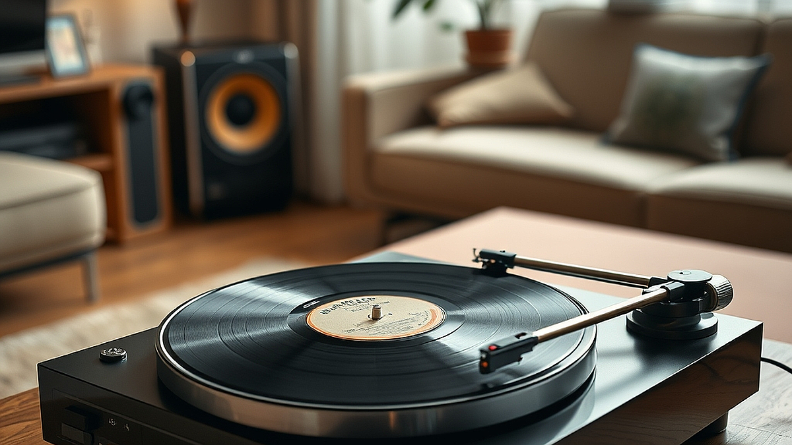

# LP 턴테이블이 다시 거실의 중심이 된 이유: '슬로우 리스닝'의 미학

LP 턴테이블이 다시 거실의 중심이 된 이유는 디지털 시대의 피로감과 그에 따른 '슬로우 리스닝'의 가치 재발견에서 찾을 수 있습니다. 스마트폰으로 수천만 곡을 즉각적으로 소비하는 스트리밍 환경은 우리에게 편리함을 주었지만, 동시에 음악을 배경 소음처럼 흘려보내는 습관을 만들었습니다. 2026년 현재, 오디오 시장에서 LP 매출이 디지털 음원 성장률을 상회하는 현상은 단순한 레트로 유행이 아닙니다. 이는 음악을 '접속'하는 것이 아니라 '경험'하려는 의지입니다. 판을 닦고, 바늘을 올리고, 뒤집어야 하는 물리적 번거로움은 역설적으로 음악에 집중하게 만드는 강력한 의식으로 작용합니다. 오늘 이 글에서는 디지털 스트리밍의 무한한 선택지 속에서 길을 잃은 당신이, 왜 거실 한구석에 턴테이블을 들여야 하는지, 그리고 어떤 기준으로 첫 장비를 선택해야 실패하지 않는지 구체적인 실무 가이드를 통해 다루어 보겠습니다.

## 왜 지금 '슬로우 리스닝'인가: 선택적 불편함의 가치

음악을 듣는 행위가 1초의 기다림도 없이 해결되는 시대에, 턴테이블은 의도적인 '지연'을 강요합니다. 이 지연은 음악을 대하는 태도를 바꿉니다. 스트리밍에서는 다음 곡으로 넘기는 '스키핑(Skipping)'이 너무나 쉽기에 우리는 앨범 전체의 서사를 온전히 듣지 못합니다. 반면 LP는 앨범의 A면을 다 듣고 일어나서 판을 뒤집어야 합니다. 이 짧은 움직임은 음악의 흐름을 끊는 방해 요소가 아니라, 방금 들은 곡의 여운을 정리하고 다음 곡을 기대하게 만드는 물리적 휴식 시간이 됩니다.

실패 사례를 하나 들어보겠습니다. 주변에서 LP가 유행이라며 가장 저렴한 일체형 올인원 턴테이블을 덜컥 구매한 지인이 있었습니다. 하지만 그는 한 달도 되지 않아 턴테이블을 창고에 넣었습니다. 이유는 소리의 질보다도 '관리의 번거로움' 때문이었습니다. LP는 판이 휘거나 바늘에 먼지가 쌓이면 즉각 소리에 반영됩니다. 이 과정을 즐기지 못하고 단순히 '음악이 나오는 기계'로만 접근하면, 스마트폰보다 훨씬 불편한 짐이 될 뿐입니다.

선택 기준은 명확합니다. 당신이 음악을 듣는 동안 스마트폰을 내려놓고 온전히 소리에만 집중할 수 있는 30분 이상의 시간이 보장되는지 확인해야 합니다. 만약 이동 중이나 업무 중에 배경음악이 필요한 목적이라면 턴테이블은 적합하지 않습니다. 턴테이블은 거실이라는 고정된 공간에서, 오직 음악을 듣기 위해 시간을 할애할 수 있는 사람에게만 최상의 만족감을 줍니다. 예산은 최소한의 음질을 보장하는 입문용 기기와 포노 앰프, 스피커를 포함해 50만 원에서 100만 원 정도를 초기 비용으로 잡는 것이 좋습니다.

## 실전 체크리스트: 장비 선택과 공간 구성의 원칙

턴테이블을 처음 구매할 때 가장 많이 범하는 실수는 '디자인만 보고 고르는 것'입니다. 턴테이블은 정밀한 기계 장치입니다. 회전 속도가 일정하지 않거나 톤암의 무게 중심이 맞지 않으면 소리가 왜곡될 뿐 아니라 소중한 LP 판이 긁히거나 손상됩니다. 따라서 입문자라면 다음 세 가지를 반드시 체크해야 합니다.

첫째, '안티 스케이팅'과 '침압 조절' 기능이 있는지 확인하세요. 저가형 제품들은 이 기능이 고정되어 있는 경우가 많은데, 이는 음반을 상하게 하는 주범입니다. 바늘이 레코드판을 누르는 힘을 조절할 수 있어야 장기적으로 음반을 보호할 수 있습니다. 둘째, 스피커와 턴테이블의 물리적 거리를 확보하세요. 스피커의 진동이 턴테이블로 전달되면 소리가 웅웅거리는 '하울링' 현상이 발생합니다. 턴테이블은 스피커와 다른 선반에 두거나, 진동 방지 패드를 반드시 활용해야 합니다. 셋째, 포노 앰프의 유무입니다. 최근 턴테이블에는 포노 앰프가 내장된 경우가 많지만, 내장된 앰프의 성능이 좋지 않으면 소리가 얇고 힘없게 들립니다. 나중에 앰프를 따로 구매할 계획이 있는지, 아니면 올인원 구성으로 끝낼 것인지 미리 정해야 합니다.

실패를 피하는 방법은 '분리형 시스템'을 고려하는 것입니다. 턴테이블, 앰프, 스피커가 하나로 합쳐진 모델은 공간 효율은 좋지만 업그레이드가 불가능합니다. 처음부터 턴테이블과 스피커를 분리해서 배치하면, 나중에 스피커만 교체하여 음질을 개선할 수 있습니다. 1인 가구라면 좁은 공간을 고려해 5인치 이하의 북쉘프 스피커를 선택하고, 거실이 넓다면 조금 더 큰 스피커를 배치하여 풍성한 저음을 즐기는 것이 공간 활용의 핵심입니다.

## 슬로우 리스닝을 유지하는 유지비와 관리 습관

LP는 구매 비용뿐만 아니라 유지비도 고려해야 하는 취미입니다. LP 한 장당 가격은 보통 3만 원에서 5만 원 사이입니다. 스트리밍 월 구독료와 비교하면 월등히 비쌉니다. 여기에 관리 도구가 필요합니다. 카본 브러시(먼지 제거용), 스타일러스 클리너(바늘 청소용), 그리고 LP 보관을 위한 속지와 겉비닐은 필수입니다. 

실제 경험을 공유하자면, 저는 매주 일요일 오후를 '관리의 시간'으로 정했습니다. 일주일간 들었던 LP의 먼지를 털어내고, 바늘 상태를 확인합니다. 이 과정이 귀찮게 느껴지면 LP 생활은 금방 끝납니다. 하지만 이 관리 시간 자체가 음악에 대한 예의이자 휴식이라고 생각하면, 턴테이블은 단순한 기기가 아니라 당신의 삶을 정돈해 주는 오브제가 됩니다. 

실패 사례로, 관리를 전혀 하지 않아 곰팡이가 피거나 휜 음반을 사서 턴테이블을 망가뜨리는 경우를 자주 봅니다. 중고 음반을 살 때는 반드시 판의 상태를 눈으로 확인하고, 세척이 가능한지 체크해야 합니다. 처음 시작할 때는 새 제품 위주로 구매하며 LP를 다루는 법을 익히고, 6개월 정도 지나 숙련도가 쌓였을 때 중고 음반 시장으로 눈을 돌리는 것을 추천합니다. 유지비는 월 평균 LP 2~3장 구매 비용과 소모품 교체 비용을 합쳐 10만 원 내외를 예상하는 것이 정신 건강에 좋습니다. 

## 결론: 당신의 거실을 음악의 안식처로 만드는 법

LP 턴테이블은 단순히 소리를 재생하는 기기가 아니라, 디지털 시대에 잃어버린 '음악을 대하는 태도'를 회복하는 도구입니다. 턴테이블을 거실에 두는 순간, 그곳은 스마트폰을 끄고 오로지 음악과 당신만이 존재하는 안식처가 됩니다. 오늘 제안한 기준인 '30분 이상의 집중 시간 확보', '분리형 장비 구성', '주기적인 관리 습관'은 당신의 오디오 취향을 더욱 깊고 단단하게 만들어 줄 것입니다. 

처음부터 고가의 장비를 무리해서 구매하기보다는, 입문용으로 시작해 턴테이블이 주는 아날로그적 휴식의 가치를 먼저 경험해 보시기 바랍니다. 만약 이 과정이 번거롭고 성가시게 느껴진다면, 그때는 스트리밍 서비스로 돌아가도 늦지 않습니다. 하지만 그 불편함 속에서 음악의 새로운 결을 발견한다면, 당신의 거실은 스트리밍 서비스가 줄 수 없는 깊은 감동으로 채워질 것입니다. 지금 바로 당신의 첫 번째 LP를 골라 턴테이블 위에 올려보십시오. 음악은 기다리는 자에게 더 깊은 울림을 들려줍니다.

LP 턴테이블은 단순히 음악을 듣는 도구를 넘어, 디지털 피로에 지친 우리 일상에 '슬로우 리스닝'이라는 소중한 쉼표를 찍어줍니다. 음악을 고르고, 바늘을 내리고, 판이 돌아가는 소리를 기다리는 그 짧은 의식은 음악을 소비의 대상이 아닌 감상의 경험으로 바꿔놓죠. 

오늘 소개해 드린 몇 가지 기준을 바탕으로, 여러분의 거실에도 아날로그만의 따뜻한 온기를 들여보시는 건 어떨까요? 처음부터 완벽할 필요는 없습니다. 그저 좋아하는 앨범 한 장을 골라 턴테이블 위에 올리는 것부터 시작해 보세요. 그 번거로움마저 즐거움으로 느껴지는 순간, 여러분의 음악 생활은 이전과는 비교할 수 없을 만큼 풍성해질 것입니다. 오늘 퇴근길, 마음을 울리는 LP 한 장과 함께 나만을 위한 온전한 휴식을 선물해 보세요. 당신의 거실이 음악으로 채워지는 그 깊은 울림을 직접 경험해 보시길 바랍니다.
