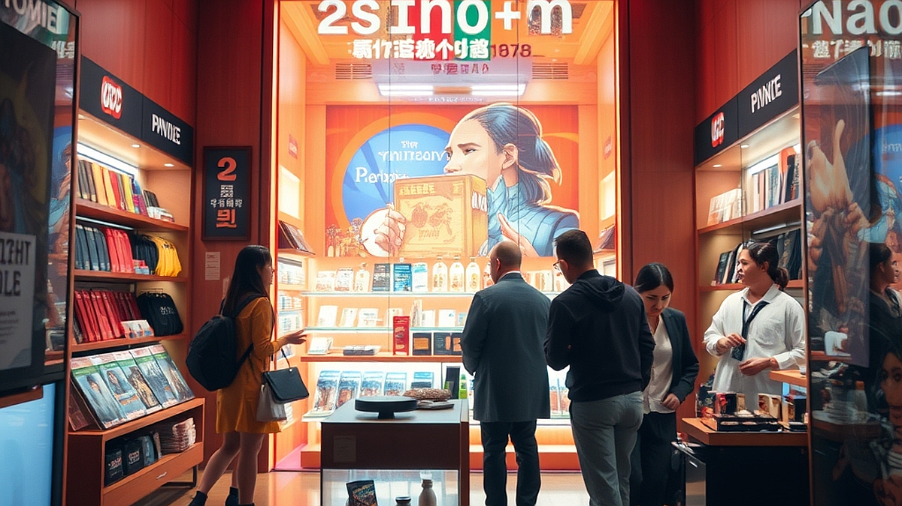

팝업스토어는 왜 인증샷을 넘어 경험의 서사를 구축하는가라는 질문은 이제 마케팅 현장에서 생존을 위한 필수적인 고민이 되었습니다. 유통업계가 2026년 하반기에 접어들며 단순히 예쁜 포토존을 만드는 수준을 넘어, 브랜드의 철학을 고객의 일상 속에 어떻게 각인시킬 것인가에 사활을 걸고 있기 때문입니다. 브랜드 담당자로서 좁은 공간에서 며칠간 운영되는 팝업이 일회성 이벤트로 휘발되지 않고, 방문객의 기억 속에 '서사'로 남게 하려면 무엇이 달라져야 할까요?

기존의 팝업스토어가 단순히 인스타그램에 올리기 좋은 공간을 제공하는 데 그쳤다면, 이제는 방문객이 스스로 주인공이 되어 브랜드의 가치를 체험하는 구조가 필요합니다. 사람들이 긴 줄을 서서 기다리는 이유는 단순히 사진을 찍기 위해서가 아니라, 그 공간에서 겪는 일련의 과정이 자신의 취향을 증명하거나 새로운 세계관을 경험하는 '놀이'가 되기 때문입니다. 이 글에서는 팝업스토어를 기획할 때 반드시 고려해야 할 서사 구조의 설계 방식과, 실무 현장에서 실패를 줄이기 위한 구체적인 체크 포인트를 다룹니다.

## 1. 공간에 서사를 입히는 단계별 기획법

팝업스토어의 서사는 공간에 들어서는 순간부터 나가는 순간까지 이어지는 호흡을 조절하는 데서 시작합니다. 단순히 제품을 진열하는 방식으로는 고객의 몰입을 끌어낼 수 없습니다. 고객이 브랜드라는 세계관에 입장하여 어떤 미션을 수행하거나, 어떤 감정적 변화를 겪고 퇴장할 것인가를 설계해야 합니다.

실무적으로 가장 먼저 해야 할 일은 브랜드가 전달하려는 핵심 가치를 '동사'로 치환하는 것입니다. 예를 들어, 지속가능성을 강조하는 브랜드라면 단순히 재활용 소재를 전시하는 것이 아니라, 고객이 직접 폐기물을 분류하고 그것이 다시 새로운 제품으로 변하는 과정을 체험하도록 동선을 짜야 합니다.

*   구체 예시: 특정 뷰티 브랜드가 신제품 팝업을 열 때, 제품의 효능을 설명하는 대신 고객이 본인의 피부 고민을 적어 '고민의 숲'에 던지고, 그 대가로 맞춤형 샘플을 처방받는 서사를 구현했습니다. 이는 단순 전시보다 훨씬 강력한 기억을 남깁니다.
*   실패 케이스: 브랜드 히스토리를 벽면에 빼곡히 적어놓고 고객에게 읽기를 강요하는 경우입니다. 고객은 정보를 소비하러 온 것이 아니라 놀러 온 것이기에, 텍스트가 아닌 '행동' 중심의 서사가 빠지면 공간은 곧 지루한 전시장이 됩니다.
*   선택 기준: 기획안이 '고객이 이곳에서 무엇을 하는가'를 명확히 답하고 있는가? 만약 '무엇을 보는가'에 초점이 맞춰져 있다면, 다시 '무엇을 경험하게 할 것인가'로 수정해야 합니다.

## 2. 실전 체크리스트: 인증샷을 넘어서는 장치들

팝업스토어의 성패는 방문객이 매장을 나간 뒤, 그들이 지인에게 자신의 경험을 어떻게 설명하느냐에 달려 있습니다. 단순히 "여기 예쁘다"라는 말은 1분이면 휘발되지만, "이런 재미있는 경험을 했는데, 너도 한번 가봐"라는 말은 강력한 바이럴이 됩니다. 이를 위해서는 공간 내부에 '대화의 단초'를 심어두어야 합니다.

현장 운영 시 반드시 점검해야 할 요소는 다음과 같습니다.

*   진입 장벽 확인: 공간의 첫인상이 너무 닫혀 있지는 않은가? 누구나 쉽게 들어와서 5분 안에 브랜드의 핵심 메시지를 이해할 수 있는가?
*   참여의 난이도: 미션이 너무 복잡하면 고객은 피로감을 느낍니다. 1단계(입장 및 인증) - 2단계(브랜드 경험) - 3단계(리워드 획득)로 이어지는 과정이 10분을 넘지 않도록 설계해야 합니다.
*   리워드의 서사성: 무조건적인 사은품 증정보다, 브랜드의 서사가 담긴 굿즈를 제공하는 것이 좋습니다. 예를 들어, 브랜드의 철학이 담긴 문구가 적힌 커스텀 스티커나, 현장에서 직접 만든 결과물을 가져가게 하는 방식입니다.

실패하기 쉬운 부분은 지나치게 높은 퀄리티의 결과물을 요구하는 경우입니다. 고객은 전문가가 아닙니다. 현장에서 5분 만에 완성할 수 있는 수준의 참여형 콘텐츠가 가장 효과적입니다. 만약 준비물이나 공간 제약으로 인해 참여형 콘텐츠가 어렵다면, 공간의 향기, 조명, 사운드 등 오감을 자극하는 환경 서사를 강화하는 것이 대안입니다.

## 3. 마케팅 효과 측정과 실패 시 점검 순서

팝업스토어가 끝난 후 단순히 방문객 수나 인스타그램 태그 개수만으로 성과를 측정하는 것은 위험합니다. 서사를 구축했다면 그 서사가 얼마나 고객에게 전달되었는지를 측정해야 합니다. 이를 위해 운영 기간 중 소규모 인터뷰나 짧은 설문을 병행하는 것을 권장합니다.

실패했을 때 점검해야 할 순서는 다음과 같습니다.
1. 데이터 불일치 확인: 방문객은 많았는데 왜 구매 전환이나 브랜드 호감도 상승으로 이어지지 않았는가? (메시지 전달 실패 여부 점검)
2. 동선 분석: 고객이 특정 구간에서 정체되거나 그냥 지나쳤다면, 그 지점의 시각적 서사가 명확하지 않았을 가능성이 높습니다.
3. 리워드 매력도: 고객이 얻어간 결과물이 브랜드와 무관한 단순 경품은 아니었는지 확인해야 합니다.

준비 비용과 시간은 브랜드의 규모에 따라 다르겠지만, 최소한 1인당 5분에서 10분의 몰입 시간을 확보할 수 있는 공간을 기획해야 합니다. 공간 대여비와 인건비를 제외하고도, 고객의 시간을 점유하는 콘텐츠 기획비가 전체 예산의 최소 30% 이상 배정되어야 단순 팝업을 넘어서는 서사 구축이 가능합니다.

## 결론: 팝업은 브랜드의 짧은 소설이다

팝업스토어는 단순히 제품을 파는 가판대가 아니라, 브랜드가 고객에게 건네는 짧은 소설과 같습니다. 서사가 없는 팝업은 사진 한 장으로 소모되지만, 서사가 있는 팝업은 고객의 일상 속에 브랜드라는 기억의 조각을 남깁니다. 지금 기획 중인 팝업스토어가 방문객에게 어떤 감정의 변화를 줄 것인지, 그들이 공간을 나설 때 어떤 문장을 입 밖으로 내뱉을 것인지 상상해보세요.

성공적인 경험 마케팅을 위해 오늘 바로 실행해야 할 일은 명확합니다. 지금 기획안의 모든 포토존을 지워보십시오. 포토존을 제외하고도 사람들이 브랜드의 매력을 느낄 수 있는 '행동'이 남아 있습니까? 만약 없다면, 그 빈자리를 브랜드의 철학을 담은 작은 체험으로 채워 넣으시기 바랍니다. 팝업스토어는 화려한 장식보다, 고객과 브랜드가 만나는 찰나의 서사가 더 오래 지속된다는 점을 기억하시길 바랍니다. 이제 여러분의 브랜드가 어떤 이야기를 들려줄 차례인지 고민을 시작할 때입니다.

팝업스토어는 단순히 제품을 전시하는 공간을 넘어, 브랜드의 철학을 고객의 일상 속에 각인시키는 하나의 서사가 되어야 합니다. 사진을 위한 화려한 장식보다 중요한 것은, 고객이 공간을 경험하며 느끼는 감정의 흐름과 브랜드와 맺는 찰나의 연결 고리입니다.

이제 여러분의 팝업스토어를 점검해 볼 시간입니다. 기획안에서 포토존을 과감히 지워보세요. 그 자리에 남은 브랜드의 본질적인 매력과 고객이 직접 참여할 수 있는 행동이 있나요? 만약 부족하다면, 그 빈틈을 브랜드만의 고유한 이야기와 작은 체험으로 채워보시길 바랍니다. 

팝업스토어는 짧지만 강렬한 브랜드의 소설입니다. 고객의 기억 속에 오래도록 남을 한 편의 이야기를 들려줄 준비가 되셨나요? 지금 바로 여러분의 브랜드가 전달하고 싶은 메시지를 고민하고, 방문객의 마음을 움직일 새로운 경험을 설계해 보세요. 여러분이 그려낼 특별한 서사를 기대하겠습니다.
