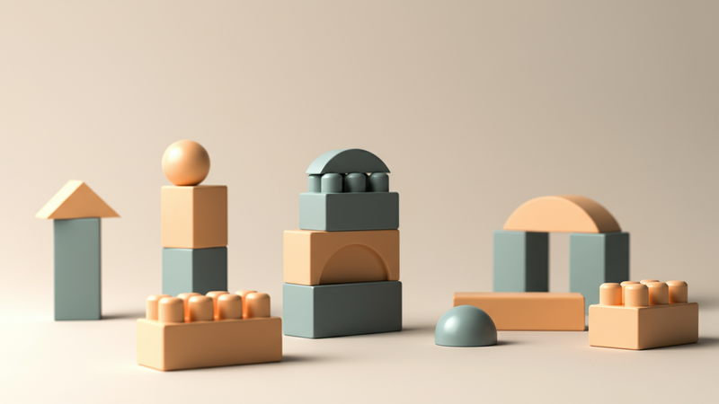

오늘날 **블록**은 단순한 유아용 장난감을 넘어, 성인들의 열정적인 _수집_ 취미이자 고도의 **마케팅** 전략이 숨 쉬는 영역으로 진화했습니다. '키덜트 마케팅 스테이지' 전문 블로거로서, 저는 이 견고한 '블록'의 세계가 어떻게 어른들의 마음을 사로잡고 거대한 시장을 형성했는지, 그리고 이 흐름 속에서 **음악**과 **앨범** 같은 문화 콘텐츠가 어떻게 융합되어 새로운 가치를 창출하는지 깊이 있게 탐구하고자 합니다. 특히 온라인 환경에서의 **SEO** 최적화 전략까지 아우르며, **블록**이 단순한 조립을 넘어선 문화적 아이콘이 된 이유와 그 **마케팅**적 함의를 분석해보겠습니다.

## 블록, 단순한 장난감을 넘어선 키덜트 문화의 상징

과거 **블록**은 주로 아이들의 전유물이었습니다. 하지만 현대 사회에서 **블록**은 _성인들의 취미 생활과 스트레스 해소 수단_으로 강력하게 자리매김했습니다. 이는 '키덜트' 현상의 핵심적인 부분이며, 어른들이 어린 시절의 향수를 느끼면서도 동시에 정교하고 복잡한 구조물을 완성하며 **성취감**을 맛보는 독특한 경험을 제공합니다. **블록**은 더 이상 단순히 '조립하고 노는 것'을 넘어, _자아 표현의 도구이자 심리적 안정감을 주는 매개체_가 된 것입니다. 이러한 변화는 **블록** 시장이 유아용 제품을 넘어 **키덜트** 세대를 위한 프리미엄 라인을 적극적으로 선보이게 하는 원동력이 되었으며, 이는 **블록 마케팅** 전략의 중요한 전환점을 의미합니다.

## 블록 수집: 견고한 성을 쌓는 어른들의 취미

**블록**을 통해 구현되는 _수집 욕구_는 **키덜트 마케팅**의 핵심 동력 중 하나입니다. 많은 성인 **블록** 애호가들은 단순히 하나의 세트를 완성하는 것을 넘어, 특정 시리즈 전체를 모으거나 희귀한 한정판 **블록**을 **수집**하는 데 열을 올립니다. 이러한 **수집** 활동은 **블록**의 가치를 단순한 장난감을 넘어선 투자 재산 혹은 예술 작품으로 끌어올리는 역할을 합니다. 특히 한정판 **블록**이나 단종된 제품들은 시간이 지날수록 그 가치가 상승하여, _'재테크'의 수단으로 인식_되기도 합니다. 완성된 **블록**을 전시하고 감상하는 행위 또한 **수집**의 큰 즐거움이며, 이는 **키덜트**들이 자신의 공간을 꾸미고 개성을 표현하는 방식의 일부가 됩니다. 기업들은 이러한 **수집**가들의 심리를 겨냥하여 **블록** 시리즈를 기획하고, 시즌별 혹은 테마별로 끊임없이 새로운 제품을 출시하며 **수집** 열기를 이어가고 있습니다. **블록**은 단순한 완제품이 아닌, _어른들의 열정과 시간이 응축된 견고한 '수집품'_으로서의 가치를 인정받고 있습니다.

## 타겟 세분화와 맞춤형 블록 마케팅 전략

### 성인 맞춤형 디자인과 복잡성

**키덜트** 시장을 겨냥한 **블록 마케팅**은 성인들의 _미적 감각과 지적 호기심_을 동시에 충족시키는 데 중점을 둡니다. 이는 아이들을 위한 **블록**과는 확연히 다른 디자인과 복잡성을 요구합니다. 예를 들어, 건축물 시리즈는 실제 건축물의 **정교함**을 재현하며 _디테일에 대한 성인들의 욕구_를 충족시킵니다. 테크닉 시리즈는 복잡한 기어와 동력 시스템을 통해 **공학적 지식과 문제 해결 능력**을 요구하며, 이는 단순한 조립을 넘어선 **도전 의식**을 자극합니다. 이러한 성인 맞춤형 **블록**들은 _장식용 오브제로서의 가치_도 높아, 완성 후에도 오랫동안 소장하고 전시할 수 있게 합니다. **블록** 제조사들은 **키덜트** 소비자들이 원하는 디자인과 난이도를 정확히 파악하여, **마케팅** 전략의 핵심 요소로 활용하고 있습니다.

### 브랜드 협업과 IP 활용: 블록 세계관 확장

오늘날 **블록 마케팅**의 가장 강력한 전략 중 하나는 바로 _유명 브랜드와의 협업과 IP(지적재산권) 활용_입니다. 영화, 게임, 애니메이션, 자동차, 심지어 **음악**에 이르기까지 다양한 분야의 인기 IP가 **블록**으로 재탄생하며 팬들의 **수집** 욕구를 폭발적으로 자극하고 있습니다. 예를 들어, <스타워즈>나 <해리 포터> 같은 블록버스터 영화 IP는 이미 수많은 팬덤을 확보하고 있어, 이들이 **블록**으로 구현될 때 _높은 판매량과 충성도_를 보장합니다. 이러한 협업은 **블록** 제품 자체의 매력을 넘어, 팬들이 사랑하는 세계관의 일부를 **실물로 소유**할 수 있게 함으로써 **감성적인 연결 고리**를 형성합니다. 특히 **음악** 아티스트나 **앨범**과의 콜라보레이션은 **블록 마케팅**의 _새로운 지평을 열고 있으며, 이는 다음 섹션에서 더 자세히 다루겠습니다._ **블록**은 더 이상 고립된 완구 산업이 아닌, **문화 콘텐츠 산업 전반**과 유기적으로 연결되며 **마케팅**의 가능성을 무한히 확장하고 있습니다.

## 블록과 음악, 앨범: 콜라보레이션 마케팅의 진화

**블록**과 **음악**, 그리고 **앨범**의 만남은 **키덜트 마케팅**에 _새로운 차원의 시너지_를 불어넣고 있습니다. 과거에는 상상하기 어려웠던 이러한 이종 산업 간의 **콜라보레이션**은 **블록**의 **수집** 가치를 높이는 동시에, **음악** 팬들에게 _독특한 굿즈를 제공_하는 역할을 합니다. 예를 들어, 특정 밴드의 **앨범** 발매를 기념하여 **앨범** 커버를 **블록**으로 재현하거나, 유명 **음악**가의 작업실, 공연 무대 등을 **블록**으로 정교하게 구현한 한정판 세트가 출시되기도 합니다. 이러한 제품들은 **음악** 팬들에게는 소장 가치가 높은 기념품이 되고, **블록** 애호가들에게는 _새로운 테마의 **블록**을 **수집**할 기회_를 제공합니다. 또한, 일부 아티스트들은 **뮤직비디오**에 **블록**을 활용하여 _시각적으로 흥미로운 콘텐츠_를 제작하기도 합니다. 이러한 **음악**과 **블록**의 결합은 단순한 제품 판매를 넘어, **브랜드 스토리텔링**을 강화하고 **팬덤**을 확장하는 효과적인 **마케팅** 도구로 활용됩니다. **블록**은 이제 **음악**이라는 _청각적 경험을 시각적, 촉각적으로 확장하는 매개체_로서 그 역할을 톡톡히 해내고 있습니다.

## 블록 마케팅의 SEO 최적화 방안

오늘날 온라인 환경에서 **블록 마케팅**의 성공은 **SEO(검색 엔진 최적화)** 전략과 _불가분의 관계_에 있습니다. 아무리 훌륭한 **블록** 제품과 **마케팅** 캠페인이 있더라도, 소비자들이 검색을 통해 제품 정보를 쉽게 찾을 수 없다면 **마케팅** 효과는 반감될 수밖에 없습니다. 따라서 **블록** 관련 콘텐츠는 **SEO**를 고려하여 작성되어야 합니다.

- **타겟 키워드 연구 및 활용**이 필수적입니다. '성인 **블록**', '취미 **블록**', '**수집 블록**', '한정판 **블록**', '**블록** 피규어' 등 **키덜트** 소비자들이 실제로 검색할 만한 키워드를 파악하고, 이를 제목, 본문, 메타 설명 등에 자연스럽게 포함시켜야 합니다.
- **고품질의 콘텐츠 제작**은 **SEO**의 기본입니다. 단순히 제품을 나열하는 것을 넘어, **블록** 조립 후기, 전시 아이디어, **블록** 역사를 통한 스토리텔링, **음악** **앨범** 콜라보레이션 비하인드 스토리 등 _정보 가치가 높고 흥미로운 콘텐츠_를 제공해야 합니다. 이는 방문자 체류 시간을 늘리고, 재방문을 유도하며, 궁극적으로 검색 엔진 순위 상승에 기여합니다.
- **이미지 및 동영상 최적화**도 중요합니다. **블록** 제품의 특성상 시각적 자료가 매우 중요하므로, 고해상도 이미지를 사용하고 \`alt\` 태그에 핵심 키워드를 포함시키는 것이 좋습니다. **블록** 조립 과정이나 완성품을 보여주는 동영상은 **블록**의 매력을 효과적으로 전달할 수 있습니다.
- **신뢰할 수 있는 외부 링크 구축**입니다. 관련 뉴스 기사나 공신력 있는 기관의 자료로 연결되는 **외부 링크**는 콘텐츠의 신뢰도를 높이고 **SEO**에 긍정적인 영향을 미칩니다. (예: [연합뉴스 키덜트 시장 관련 기사](https://www.yonhapnews.co.kr/search/search?keyword=%ED%82%A4%EB%8D%9C%ED%8A%B8+%EC%8B%9C%EC%9E%A5))
- **메타 데이터 최적화**입니다. \`<title>\` 태그와 \`<meta name="description">\`에 핵심 키워드를 포함하여 검색 결과에서 _사용자들의 클릭을 유도_할 수 있도록 작성해야 합니다. 이처럼 **SEO**는 **블록 마케팅**의 _온라인 가시성을 확보하고 잠재 고객을 유입하는 데 필수적인 요소_입니다.

## 결론: 블록, 단순한 조립을 넘어선 가치 창출

결론적으로, **블록**은 단순한 유년 시절의 장난감을 넘어, 현대 **키덜트** 문화의 핵심적인 아이콘이자 **마케팅** 성공 사례를 만들어가는 역동적인 분야로 자리매김했습니다. _향수, 수집 욕구, 성취감, 그리고 예술성_이라는 다양한 가치를 융합하며, **블록**은 어른들의 삶에 긍정적인 영향을 미치고 있습니다. 특히 **음악** **앨범**과 같은 **문화 콘텐츠와의 경계 없는 콜라보레이션**은 **블록**의 **마케팅** 가능성을 무한히 확장시키고 있으며, **SEO**를 통한 온라인 가시성 확보는 이러한 **마케팅** 전략의 효과를 극대화하고 있습니다. 앞으로도 **블록**은 **키덜트** 시장에서 그 영향력을 더욱 공고히 하며, _새로운 형태의 재미와 가치를 끊임없이 창출_해 나갈 것입니다. **블록**이 만들어갈 미래의 **키덜트 마케팅** 스테이지가 더욱 기대됩니다.

- **블록의 재정의:** 단순한 장난감을 넘어선 **성인 취미**와 **수집품**으로 진화하며 **키덜트 시장**의 핵심 동력으로 부상.
- **키덜트 마케팅의 핵심:** 성인들의 _어린 시절 향수와 성취감_을 동시에 자극하며 강력한 구매 욕구를 유발.
- **콜라보레이션의 힘:** **음악, 앨범, 영화 등 다양한 IP**와의 융합을 통해 **블록**의 세계관과 **마케팅** 영역을 무한히 확장.
- **수집 가치 증대:** _한정판, 희귀성_이라는 요소를 통해 **블록**의 **수집** 가치를 높여 **키덜트**들의 구매와 재투자를 촉진.
- **SEO의 중요성:** **정확한 키워드(블록, 키덜트, 수집, 마케팅, 음악, 앨범)** 사용 및 **고품질 콘텐츠 제작**으로 온라인 가시성을 확보하고 잠재 고객을 유입.

Copyright © 2025 키덜트 마케팅 스테이지. All rights reserved.
