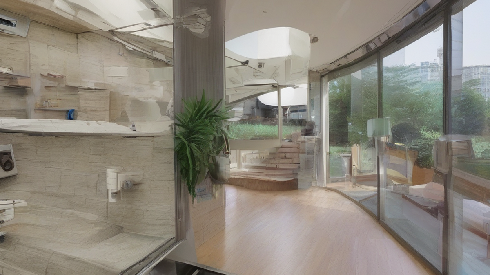

어릴 적, 누구나 한 번쯤 꿈꿨을 그 작은 블록. 어른이 된 지금, 혹시 다시 한번 그 꿈을 펼쳐보고 싶지는 않으세요? 오늘은 바로 **어른들을 위한 레고 취미 추천: 성인 레고 입문 완벽 가이드**에 대해 이야기해보려 합니다. 저요? 저는 40대 키덜트 수집가예요. 어릴 적 코 묻은 돈으로 겨우겨우 작은 레고 한두 개를 사던 추억을 소중히 간직하고 있죠. 그때는 갖고 싶어도 그림의 떡이었던 우주선이나 해적선 같은 대형 레고들을 지금은 제 손으로 직접 조립하고 진열해두곤 합니다. 제 거실에는 스타워즈 UCS 시리즈부터 모듈러 빌딩, 테크닉 슈퍼카들까지 온갖 레고들이 빼곡하게 자리를 차지하고 있어요. 지나가는 사람마다 "와, 이거 진짜 갖고 싶었는데!" 하고 감탄사를 연발하죠.

솔직히 어른이 되고 나니, 바쁜 일상 속에서 순수한 즐거움을 찾기가 쉽지 않잖아요? 그런데 이 레고라는 녀석은 정말 신기해요. 박스를 열고 작은 브릭들을 손으로 만지는 순간, 어릴 적 동심으로 돌아간 듯한 기분이 듭니다. 복잡한 생각들은 저 멀리 사라지고, 오직 눈앞의 매뉴얼과 브릭에만 집중하게 되죠. 그렇게 몇 시간이고 몰입하다 보면, 어느새 멋진 작품이 뚝딱 완성되어 있습니다. 그 성취감이란 이루 말할 수 없어요! 단순히 조립하는 것을 넘어, 완성된 작품을 멋지게 전시하고, 또 같은 취미를 가진 사람들과 이야기 나누는 과정까지, 레고는 생각보다 훨씬 다채로운 즐거움을 선사합니다. 이 글을 통해 저처럼 레고의 매력에 푹 빠져보고 싶은 분들을 위해, 어떻게 시작해야 할지, 어떤 점을 고려해야 할지 저의 솔직한 경험담과 함께 자세히 알려드릴게요.

## 어른이 되어 다시 만난 레고, 왜 이렇게 좋을까요?

"아니, 그 비싼 돈 주고 왜 애들 장난감을 사?" 가끔 이런 말을 듣기도 합니다. 하지만 레고는 더 이상 아이들만의 장난감이 아니에요. 요즘 나오는 성인용 레고들을 보면 입이 떡 벌어질 정도로 정교하고 아름다운 작품들이 많습니다. 저는 레고를 단순히 '장난감'이라고 부르기보다는 '움직이는 조형 예술 작품'이라고 소개하고 싶어요. 복잡한 현대 사회를 살아가는 우리 어른들에게 레고는 단순한 취미를 넘어 다양한 가치를 선물합니다.

무엇보다 가장 큰 장점은 바로 *스트레스 해소와 집중력 향상*입니다. 하루 종일 복잡한 업무와 사람 관계에 시달리다가 집에 돌아와 레고 박스를 열고 브릭을 조립하는 시간은 저에게 일종의 명상과도 같아요. 잡념이 사라지고 오직 눈앞의 작은 브릭 하나하나에만 집중하게 되거든요. 매뉴얼을 따라 블록을 쌓고 끼우다 보면 자연스럽게 몰입하게 되고, 그렇게 몇 시간이고 앉아 있어도 피곤하기보다는 오히려 마음이 평화로워지는 것을 느낍니다. TV나 스마트폰으로 시간을 보내는 것보다 훨씬 생산적이고 능동적인 힐링의 시간을 가질 수 있죠. 어릴 적에는 그저 완성된 모양에만 신경 썼다면, 지금은 작은 기어 하나가 큰 바퀴를 움직이는 원리, 견고하게 구조물을 지탱하는 조립 방식 같은 것들을 보면서 감탄하고, 또 배우기도 합니다.

또 레고는 *수집의 기쁨과 디스플레이의 만족감*이 남다릅니다. 거실 한편을 가득 채운 제 레고들을 볼 때마다 뿌듯함이 밀려와요. 특히 스타워즈 밀레니엄 팔콘 UCS 버전이나 에펠탑, 콜로세움 같은 대형 작품들은 그 자체로 훌륭한 인테리어 소품이 되어줍니다. 저 같은 경우엔 어릴 적 만화책에서나 보던 멋진 우주선이나, 당시엔 꿈도 못 꿨던 '기차역 모듈러 빌딩' 같은 걸 제 손으로 직접 만들었을 때의 감격이란… 정말 말로 표현할 수 없죠. 그렇게 완성된 작품들을 보면서 지나간 추억을 회상하고, 또 앞으로 어떤 작품을 만들지 행복한 상상을 하는 것 자체가 큰 즐거움이 됩니다.

간혹 레고의 *투자 가치*에 대해 묻는 분들도 계십니다. 실제로 특정 단종 모델, 특히 모듈러 빌딩 시리즈나 희귀한 테크닉 차량 같은 경우 시간이 지남에 따라 가격이 크게 오르기도 해요. 2010년대 초반에 나온 모듈러 빌딩 중 어떤 제품들은 지금 새것 같은 중고품을 구하려면 출시가 대비 2~3배는 줘야 할 정도죠. 저도 몇몇 단종 레고를 미개봉 상태로 보관하고 있긴 합니다만, 저는 기본적으로 레고를 '투기'의 대상으로 보기보다는 '수집'과 '취미' 그 자체로 즐기는 것을 권해드립니다. 어차피 취미는 즐거움이 우선이잖아요? 가격이 오르면 좋겠지만, 그렇지 않더라도 조립하는 과정과 완성품을 보면서 얻는 행복감은 돈으로 환산할 수 없는 가치입니다. 제 아들이 제가 조립한 레고로 신나게 놀고 있을 때, 그때의 감동은 그 어떤 리세일 가격보다도 소중하더군요.

## 나에게 딱 맞는 성인 레고, 어떻게 고를까?

자, 이제 레고의 매력에 푹 빠지셨다면, 다음은 어떤 레고를 골라야 할지 고민이 시작될 겁니다. 레고 코너에 가보면 정말 다양한 종류와 테마가 있어서 뭘 골라야 할지 막막할 수 있어요. 저도 처음엔 무조건 멋있어 보이는 것, 혹은 비싼 것을 골랐다가 실망한 적도 여러 번 있습니다. 제 시행착오를 바탕으로 여러분이 후회 없는 첫 레고를 고를 수 있도록 몇 가지 팁을 드릴게요.

### 2025년 최신 트렌드와 인기 테마 분석

요즘 성인 레고 시장은 정말 뜨겁습니다. 2025년을 앞두고도 다양한 신제품들이 쏟아져 나오고 있고, 특히 성인 취향을 저격하는 테마들이 큰 인기를 끌고 있어요.

*   **레고 아이콘스 (LEGO Icons, 구 Creator Expert):** 이 시리즈는 성인 레고의 대표 주자라고 할 수 있습니다. 섬세한 디테일과 완성도 높은 디자인이 특징이죠. 특히 '모듈러 빌딩' 시리즈는 저의 최애 테마 중 하나인데, 재즈 클럽, 자연사 박물관 같은 최신작들은 물론이고, 옛날 모델들과 연결하면 근사한 미니 도시를 만들 수 있습니다. 또 포르쉐, 람보르기니 같은 '차량 시리즈'나 타자기, 카세트 플레이어 등 향수를 자극하는 '레트로 테마'도 인테리어 소품으로 최고예요.
*   **레고 아키텍처 (LEGO Architecture):** 심플하면서도 고급스러운 분위기를 선호한다면 이 시리즈가 딱입니다. 에펠탑, 자유의 여신상, 피라미드 같은 세계 각지의 랜드마크를 정교하게 재현한 모델들이 많아요. 거실이나 서재에 두면 그 자체로 예술 작품 같은 느낌을 줍니다. 조립 난이도도 너무 어렵지 않아서 입문용으로도 좋습니다.
*   **레고 테크닉 (LEGO Technic):** 단순히 조립하는 것을 넘어 기계적인 움직임과 기능에 관심이 많다면 테크닉 시리즈가 제격입니다. 복잡한 기어와 서스펜션 시스템을 통해 실제 차량처럼 구동하는 모델들을 만들 수 있어요. 부가티 시론, 람보르기니 시안 같은 슈퍼카는 조립 과정도 흥미롭고, 완성 후에는 멋진 디스플레이 효과도 얻을 수 있습니다. 다만, 조립 난이도가 높은 편이라 레고 입문자에게는 조금 버거울 수도 있어요. 처음부터 너무 어려운 테크닉을 선택하면 중간에 지쳐서 포기할 수도 있으니 주의하세요!
*   **레고 아이디어스 (LEGO Ideas):** 전 세계 레고 팬들의 아이디어가 제품화되는 시리즈예요. 그래서 독특하고 개성 넘치는 디자인이 많습니다. 반 고흐의 '별이 빛나는 밤', 타자기, 어스 글로브 등 예술 작품이나 실용적인 소품 같은 모델들이 인기를 얻고 있어요. 한정판 느낌이 강해서 소장 가치도 높습니다.
*   **레고 스타워즈 UCS / 마블 / 해리포터:** 특정 IP(지적재산권)의 열혈 팬이라면 이 시리즈들을 빼놓을 수 없습니다. 특히 스타워즈의 UCS(Ultimate Collector Series)는 엄청난 크기와 디테일로 유명하죠. 밀레니엄 팔콘이나 임페리얼 스타 디스트로이어 같은 모델은 조립 시간만 해도 며칠이 걸리지만, 완성하고 나면 그 웅장함에 감탄하게 될 겁니다. 해리포터의 호그와트 성이나 마블의 어벤져스 타워도 마찬가지고요.

*   **레고 보태니컬 컬렉션 (LEGO Botanical Collection):** 최근 몇 년 사이 폭발적인 인기를 얻고 있는 테마입니다. 꽃다발, 난초, 선인장, 분재 등 식물들을 레고 브릭으로 표현한 시리즈인데, 실제 꽃처럼 시들지 않아 오랫동안 감상할 수 있어요. 집안 분위기를 생기 있게 바꿔주는 효과도 있고, 여자 친구나 아내에게 선물하기에도 딱 좋습니다. 저도 아내에게 선물했는데 정말 좋아하더군요!

### 첫 구매를 위한 실용적인 팁

이렇게 많은 레고 중에 뭘 골라야 할지 여전히 고민이시죠? 첫 구매를 위한 몇 가지 실용적인 팁을 알려드릴게요.

1.  **예산 설정:** 처음부터 너무 비싼 UCS 같은 대형 제품보다는 10만 원대에서 30만 원대 사이의 제품으로 시작하는 것을 추천합니다. 조립의 재미를 느끼고, 레고가 나에게 잘 맞는 취미인지 탐색하는 데 부담 없는 가격대이죠. 저도 처음엔 멋만 보고 비싼 걸 덜컥 샀다가, 난이도에 좌절하고 박스째 방치했던 흑역사가 있습니다...
2.  **관심사 우선:** 가장 중요한 것은 '내가 좋아하는 테마'를 고르는 것입니다. 자동차, 영화, 건축, 자연 등 평소 내가 관심 있었던 분야의 레고를 선택해야 조립 과정이 지루하지 않고, 완성 후에도 애착이 갑니다. 억지로 유행을 따르기보다는 나 자신의 취향을 존중해주세요.
3.  **난이도 고려:** 레고는 제품별로 조립 난이도가 천차만별입니다. 처음이라면 테크닉이나 일부 아이콘스 시리즈처럼 복잡한 제품보다는 아키텍처나 보태니컬 컬렉션, 혹은 비교적 작은 아이콘스 시리즈로 시작하는 것이 좋습니다. 쉬운 것부터 차근차근 난이도를 올려가며 성취감을 느끼는 것이 중요해요.
4.  **조립 시간 vs 전시 효과:** 내가 레고를 통해 얻고 싶은 것이 무엇인지 생각해 보세요. 조립 자체의 몰입감을 즐기는지, 아니면 완성된 작품을 멋지게 전시하는 즐거움이 더 큰지. 테크닉은 조립 과정이 길고 복잡하지만 기능적인 만족감이 크고, 아키텍처는 비교적 조립 시간이 짧으면서도 전시 효과가 뛰어납니다.
5.  **박스 상태, 미개봉 여부:** 혹시 나중에 리세일 가치까지 염두에 둔다면, 박스 상태가 좋고 미개봉 제품을 구매하는 것이 중요합니다. 하지만 앞서 말했듯, 가장 중요한 건 즐거움이라는 사실 잊지 마세요!

## 조립 그 이상의 즐거움: 보관, 전시, 그리고 커뮤니티

레고는 단순히 조립하는 것으로 끝나는 취미가 아닙니다. 완성된 작품을 어떻게 보관하고 전시하느냐에 따라 그 가치와 만족감이 크게 달라져요. 그리고 같은 취미를 공유하는 사람들과 소통하는 것 또한 레고 생활의 큰 즐거움 중 하나입니다.

### 나의 레고들을 돋보이게 하는 전시 노하우

열심히 시간과 공을 들여 만든 레고 작품, 아무렇게나 방치할 수는 없죠? 멋지게 전시해야 그 가치가 더욱 빛납니다.

*   **진열장 활용:** 가장 기본적인 방법은 먼지로부터 레고를 보호해 줄 진열장을 사용하는 것입니다. 특히 유리로 된 진열장은 시각적으로도 깔끔하고, 레고가 돋보이게 하는 효과가 있어요. 이케아의 데톨프 같은 제품은 가성비가 좋아서 많은 레고 수집가들이 애용합니다. 저도 처음엔 레고들을 그냥 책장 위에 올려뒀다가, 나중에 먼지 때문에 고생하고 나서 진열장의 중요성을 깨달았습니다.
*   **조명 효과:** 진열장에 LED 라이트 킷을 추가하면 레고 작품에 생명을 불어넣을 수 있습니다. 특히 모듈러 빌딩 시리즈는 건물 내부에 조명을 설치하면 한밤의 도시처럼 환상적인 분위기를 연출할 수 있어요. 조명은 레고의 디테일을 더욱 살려주고, 밤에는 멋진 무드등 역할도 해줍니다.
*   **공간 배치:** 레고를 전시할 때는 주변 공간과의 조화도 중요합니다. 너무 복잡하게 한 곳에 몰아두기보다는, 각 작품이 돋보일 수 있는 적절한 공간을 찾아 배치하는 것이 좋습니다. 저는 거실 한쪽 벽면을 레고 전시 공간으로 꾸며두었는데, 손님들이 올 때마다 시선이 집중되는 '아트 월' 역할을 톡톡히 합니다.
*   **먼지 관리:** 레고는 먼지에 매우 취약합니다. 브릭 틈새에 먼지가 끼면 미관상 좋지 않고, 제거하기도 쉽지 않아요. 에어 블로워나 부드러운 브러시, 혹은 극세사 천으로 주기적으로 먼지를 털어주는 것이 중요합니다. 귀찮다고 미루다 보면 나중에 정말 감당하기 어려워질 수 있어요. 제 오래된 레고들은 세월의 흔적과 함께 먼지의 흔적도 깊게 배어있답니다... 지금은 눈물을 머금고 하나하나 분해해서 세척하고 있죠.

### 리세일 가치, 진짜 중요할까?

앞서 잠시 언급했지만, 레고의 리세일 가치에 대해 다시 한번 짚고 넘어갈게요. 수집가에게는 중요한 요소임은 분명합니다. 단종 여부, 출시 당시의 인기, 미개봉 상태 등이 중고 가격에 큰 영향을 미칩니다. 어떤 레고들은 출시가보다 몇 배나 비싸게 거래되기도 하니까요. 특히 모듈러 빌딩이나 인기 IP 기반의 대형 모델들은 단종 후 가격이 오르는 경우가 많습니다.

하지만 저는 레고를 즐기는 가장 중요한 가치는 '즐거움'이라고 생각합니다. 너무 시세에 연연해서 즐거움을 반감시키지 마세요. 물론 미래 가치를 생각하며 미개봉으로 보관하는 것도 하나의 방법이지만, 결국 레고는 만들어서 즐기는 것이 본질입니다. 제가 어릴 적 그렇게나 갖고 싶었지만 형편이 안 돼서 살 수 없었던 '해적선' 레고가 지금은 중고가가 수십만 원을 호가하더군요. 그때 못 산 게 한이라면 한이지만, 지금은 제가 직접 조립한 레고를 제 아들이 갖고 놀면서 행복해하는 모습을 보는 것만으로도 충분히 만족합니다.

### 레고 친구들과 함께하는 즐거움

혼자 조립하고 전시하는 것도 즐겁지만, 같은 취미를 가진 사람들과 함께하는 즐거움은 또 다릅니다. 요즘에는 온라인 커뮤니티나 동호회가 활성화되어 있어서 다양한 사람들과 정보를 공유하고, 조립 노하우를 배우며, 신제품 품평을 함께 할 수 있어요. 저도 몇몇 온라인 커뮤니티에서 활동하면서 새로운 친구들도 사귀고, 제가 몰랐던 레고의 세계를 더 깊이 탐험하고 있습니다.

또 가끔 열리는 레고 전시회나 브릭 컨벤션에 참여해보는 것도 좋은 경험이 됩니다. 다른 사람들의 멋진 MOC(My Own Creation, 창작 레고) 작품들을 구경하고, 직접 만든 사람과 이야기를 나누다 보면 새로운 영감을 얻기도 합니다. 이런 경험들은 레고 취미를 더욱 풍성하고 다채롭게 만들어 줄 거예요. 여러분도 레고로 세상과 소통하는 즐거움을 느껴보시길 바랍니다.

레고는 단순히 브릭을 쌓아 올리는 행위를 넘어, 어릴 적 동심을 소환하고, 현대인의 스트레스를 해소하며, 새로운 사람들과 소통하는 통로가 되어줍니다. 작은 플라스틱 조각들이 모여 하나의 작품이 되는 과정은 마치 우리 삶과도 닮아있다는 생각이 들어요. 하나하나의 경험들이 모여 우리라는 멋진 작품을 완성하는 것처럼 말이죠.

## 망설이지 말고, 당신의 레고를 찾아보세요!

오늘은 어른들을 위한 레고 취미, 성인 레고 입문 완벽 가이드에 대해 이야기해 보았습니다. 어릴 적의 순수한 열정을 다시금 불러일으키고 싶은 분들에게, 복잡한 일상 속에서 잠시나마 몰입의 즐거움을 찾고 싶은 분들에게, 그리고 나만의 특별한 공간을 멋지게 꾸미고 싶은 분들에게 레고는 정말 최고의 선택이 될 수 있습니다. 스트레스 해소는 물론, 창의력 증진, 그리고 완성품을 바라볼 때의 뿌듯함까지, 레고가 주는 가치는 생각보다 훨씬 크고 깊습니다.

제 경험을 통해 레고를 선택하는 팁부터 효율적인 보관 및 전시 방법, 그리고 리세일 가치에 대한 솔직한 이야기까지 풀어보았는데요. 무엇보다 가장 중요한 것은 바로 '즐거움'이라는 점을 다시 한번 강조하고 싶습니다. 너무 완벽하게 하려고 하거나, 남의 시선을 의식하기보다는 내가 정말 만들고 싶은 레고를 선택해서, 그 과정 자체를 온전히 즐기는 것이 중요해요. 어릴 적 용돈을 아껴가며 작은 레고 하나에 행복해하던 그 순수한 마음을 다시 한번 느껴보세요.

망설이지 말고, 오늘 당장 당신의 마음에 쏙 드는 첫 레고를 찾아보는 건 어떠세요? 어쩌면 그 작은 브릭 하나가 여러분의 삶에 생각지도 못한 큰 즐거움을 가져다줄지도 모릅니다. 여러분의 멋진 레고 생활을 응원합니다!
