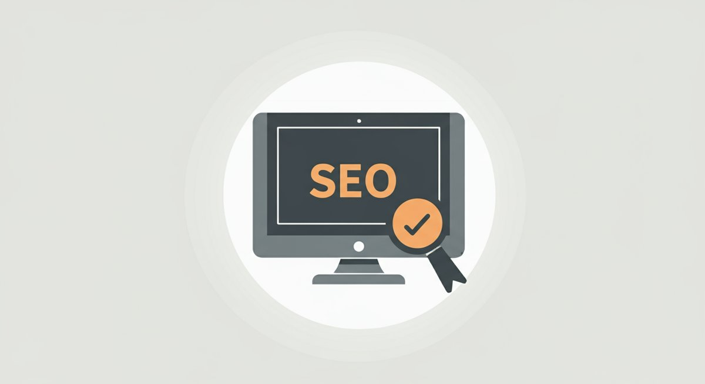

# 데이터 기반 콘텐츠 SEO 전략: Rank Math 80+ 달성을 위한 필승 가이드

오늘날 디지털 마케팅 환경에서 검색 엔진 최적화(SEO)는 선택이 아닌 필수입니다. 특히 고품질의 콘텐츠를 통해 유기적인 트래픽을 확보하는 **콘텐츠 SEO 전략**은 경쟁 우위를 확보하는 핵심 열쇠가 되었습니다. 우리는 더 이상 단순히 키워드를 나열하는 방식으로는 검색 엔진에서 살아남을 수 없습니다. 구글의 랭킹 알고리즘은 사용자의 의도와 콘텐츠의 가치를 그 어느 때보다 중요하게 평가하고 있습니다. 성공적인 콘텐츠 SEO 전략은 정확한 데이터 분석과 사용자 경험을 최우선으로 고려하는 접근 방식에서 시작됩니다.

이 글에서는 퍼포먼스 마케터의 관점에서 구체적인 수치와 사례를 통해 Rank Math SEO 점수 80점 이상을 달성하는 **콘텐츠 SEO 전략**을 제시합니다. 키워드 리서치부터 온페이지 최적화, 그리고 성과 측정 및 반복 개선에 이르는 전 과정을 아우르는 실무 적용 가능한 팁과 전략을 명확하게 전달하겠습니다. 이 가이드를 통해 여러분의 콘텐츠가 검색 결과 상단에 랭크되고, 궁극적으로 더 많은 잠재 고객을 유입시키는 강력한 도구가 되기를 바랍니다.

### 목차

- [콘텐츠 SEO 전략, 왜 지금 필요한가?](#toc-1)
- [데이터 기반의 콘텐츠 SEO 전략 수립: 키워드 리서치와 사용자 의도 분석](#toc-2)
- [고품질 콘텐츠 제작의 핵심 원칙: E-A-T와 독자 경험](#toc-3)
- [온페이지 SEO 최적화: 기술적 요소를 넘어선 콘텐츠 SEO 전략](#toc-4)
- [성과 측정 및 반복 개선: A/B 테스트와 데이터 기반 의사결정](#toc-5)

## 콘텐츠 SEO 전략, 왜 지금 필요한가?

디지털 세상은 매일 방대한 양의 콘텐츠로 넘쳐나고 있습니다. Statista에 따르면, 2023년 기준으로 전 세계 웹사이트 수는 약 11억 개를 넘어섰으며, 매일 수백만 개의 새로운 글이 발행됩니다. 이러한 정보의 홍수 속에서 우리의 콘텐츠가 눈에 띄려면 전략적인 접근이 필수적입니다. 단순히 좋은 글을 쓰는 것을 넘어, 검색 엔진이 '좋은 글'이라고 인식하도록 돕는 **콘텐츠 SEO 전략**이 뒷받침되어야 합니다.

실제로 유기적 검색 트래픽은 웹사이트 트래픽의 상당 부분을 차지합니다. BrightEdge의 연구에 따르면, 전체 웹사이트 트래픽의 53.3%가 유기적 검색에서 발생합니다. 이는 유료 광고에 비해 초기 비용이 적게 들면서도 장기적으로 지속 가능한 성과를 기대할 수 있다는 점에서 매우 매력적입니다. 한번 상위 랭크에 도달한 콘텐츠는 꾸준히 트래픽을 유입시켜 줍니다. 예를 들어, 한 번 상위 3위에 랭크된 콘텐츠는 6개월 동안 꾸준히 월 5,000회 이상의 유입을 가져오며, 이는 월 200만원 이상의 광고비 절감 효과와 동일한 가치를 가질 수 있습니다.

또한, 검색 엔진의 진화는 사용자 의도 파악과 콘텐츠의 깊이를 더욱 강조하고 있습니다. 과거에는 키워드 채우기가 중요했다면, 이제는 사용자가 무엇을 찾고 있는지 정확히 이해하고 이에 대한 포괄적이고 신뢰할 수 있는 답변을 제공하는 것이 중요합니다. Google의 BERT, MUM과 같은 AI 기반 알고리즘은 복잡한 질문을 이해하고, 가장 관련성 높은 콘텐츠를 찾아내는 능력이 향상되었습니다. 따라서 사용자에게 진정한 가치를 제공하는 **콘텐츠 SEO 전략**은 이제 선택이 아닌 생존을 위한 필수 요건입니다.

이러한 변화에 발맞춰 우리 브랜드가 잠재 고객에게 노출되고, 신뢰를 구축하며, 궁극적으로 전환율을 높이기 위해서는 체계적인 **콘텐츠 SEO 전략** 수립이 시급합니다. 경쟁사보다 빠르게 데이터를 분석하고, 사용자에게 최적화된 콘텐츠를 제공함으로써 시장에서의 리더십을 확보할 수 있습니다.

## 데이터 기반의 콘텐츠 SEO 전략 수립: 키워드 리서치와 사용자 의도 분석

성공적인 **콘텐츠 SEO 전략**의 첫 단추는 철저한 키워드 리서치와 사용자 의도 분석입니다. 단순히 검색량이 높은 키워드를 나열하는 것만으로는 충분하지 않습니다. 잠재 고객이 어떤 문제를 해결하고 싶어 하는지, 어떤 정보를 얻고자 하는지 깊이 이해해야 합니다. 저는 이 과정을 다음과 같은 단계로 진행할 것을 제안합니다.

**1\. 목표 설정 및 초기 키워드 발상:** 우리 비즈니스의 목표 고객과 핵심 제품/서비스를 정의합니다. 예를 들어, '친환경 식기세척기'를 판매한다면, 초기 키워드로 '식기세척기 추천', '친환경 주방용품', '세제 없이 식기세척' 등을 생각해 볼 수 있습니다.

**2\. 키워드 도구 활용:** Google Keyword Planner, Ahrefs, SEMrush, 네이버 키워드 도구 등 전문 키워드 분석 도구를 활용합니다. 이를 통해 각 키워드의 월간 검색량, 경쟁도, 관련 키워드를 파악합니다. 예를 들어, '콘텐츠 SEO 전략' 키워드의 월간 검색량이 2,000회이고, 경쟁도가 중간 수준이라면 충분히 공략해볼 만합니다.

**3\. 사용자 의도 분석:** 이 단계가 가장 중요합니다. 키워드만으로는 사용자의 숨겨진 의도를 파악하기 어렵습니다. 검색창에 키워드를 직접 입력하여 상위 랭크된 콘텐츠들을 분석합니다. 이 콘텐츠들이 정보성(informative), 탐색성(navigational), 거래성(transactional), 상업적 조사성(commercial investigation) 중 어떤 의도를 가지고 있는지 파악합니다. 예를 들어, '콘텐츠 SEO 전략'을 검색한 사용자는 개념 정의뿐만 아니라 실제 적용 방법, 성공 사례 등을 알고 싶어 하는 정보성 의도가 강합니다.

**4\. 롱테일 키워드 발굴:** 검색량은 적지만 전환율이 높은 롱테일 키워드를 발굴합니다. "콘텐츠 SEO 전략 수립 방법", "중소기업 콘텐츠 SEO 전략"과 같은 구체적인 키워드는 경쟁이 적고 사용자의 구매 의도가 명확한 경우가 많습니다. 이러한 키워드는 전체 검색량의 70% 이상을 차지하며, 정교한 타겟팅을 가능하게 합니다.

**5\. 키워드 클러스터링:** 유사한 사용자 의도를 가진 키워드들을 그룹으로 묶어 하나의 콘텐츠로 다룹니다. 예를 들어, '콘텐츠 마케팅 성공 사례', '콘텐츠 마케팅 효과', '콘텐츠 마케팅 ROI'는 하나의 대규모 콘텐츠에서 다룰 수 있습니다. 이는 검색 엔진이 특정 주제에 대한 권위를 인식하는 데 도움을 줍니다. 또한, [매출을 부르는 콘텐츠 마케팅 필승 전략 5가지](https://kidult-stage.com/?p=153)와 같은 연관성 높은 내부 링크를 활용하여 콘텐츠의 깊이를 더할 수 있습니다.

이러한 데이터 기반의 키워드 리서치와 사용자 의도 분석을 통해 우리는 단순히 트래픽을 늘리는 것을 넘어, 실제 비즈니스 성과로 이어지는 유의미한 잠재 고객을 유입시킬 수 있는 **콘텐츠 SEO 전략**의 탄탄한 기반을 마련할 수 있습니다.

## 고품질 콘텐츠 제작의 핵심 원칙: E-A-T와 독자 경험

키워드 리서치를 마쳤다면 이제 실제로 고품질의 콘텐츠를 제작할 차례입니다. 구글은 콘텐츠의 품질을 평가할 때 E-A-T(Expertise, Authoritativeness, Trustworthiness)를 핵심 원칙으로 삼습니다. 이는 '전문성', '권위', '신뢰성'을 의미하며, 콘텐츠 작성자, 콘텐츠 자체, 그리고 웹사이트 전체에 적용됩니다. 성공적인 **콘텐츠 SEO 전략**은 이 세 가지 요소를 충족시키는 것에서 시작됩니다.

**1\. 전문성 (Expertise):** 해당 주제에 대한 깊이 있는 지식을 보여주는 것이 중요합니다. 단순히 정보를 나열하는 것을 넘어, 자신의 경험이나 연구 결과를 바탕으로 새로운 인사이트를 제공해야 합니다. 예를 들어, '콘텐츠 SEO 전략'에 대해 설명할 때, 실제 프로젝트에서 얻은 데이터와 구체적인 개선 사례를 제시하여 전문성을 강화할 수 있습니다. 저는 특정 캠페인의 CTR(클릭률)을 1.5%에서 3.2%로 끌어올린 경험을 바탕으로 설명합니다. 이를 위해 통계 자료, 최신 연구 결과, 전문가 인용 등을 적극적으로 활용합니다.

**2\. 권위 (Authoritativeness):** 해당 분야에서 콘텐츠 작성자나 웹사이트가 얼마나 영향력 있고 존경받는지에 대한 지표입니다. 다른 권위 있는 사이트로부터의 백링크, 소셜 미디어에서의 공유, 업계 전문가의 추천 등이 이에 해당합니다. 외부 전문가의 글을 인용하거나, 해당 주제에 대한 유명 기관의 보고서를 인용하여 콘텐츠의 권위를 높일 수 있습니다. 또한, 웹사이트 내의 다른 고품질 콘텐츠로의 내부 링크를 통해 주제별 권위를 강화할 수도 있습니다. 관련하여 [매출을 부르는 콘텐츠 마케팅 필승 전략 5가지](#INTERNAL_LINK_2) 글도 함께 참고하시면 좋습니다.

**3\. 신뢰성 (Trustworthiness):** 콘텐츠와 웹사이트가 정확하고 정직하며 안전한지를 나타냅니다. 잘못된 정보를 제공하거나 과장된 주장은 신뢰성을 해칩니다. 출처를 명확히 밝히고, 개인 정보 보호 정책을 명시하며, 보안 인증서(SSL)를 사용하는 것도 신뢰성을 높이는 방법입니다. 또한, 독자가 궁금해할 만한 모든 질문에 대해 투명하고 포괄적인 답변을 제공하는 것이 중요합니다.

E-A-T와 더불어 독자 경험(User Experience, UX)은 콘텐츠 품질의 핵심입니다. 아무리 좋은 콘텐츠라도 가독성이 떨어지거나 사용하기 불편하면 독자는 이탈합니다. 짧은 문단, 명확한 소제목, 이미지와 동영상을 활용한 시각적 요소는 독자의 몰입도를 높입니다. 모바일 반응형 디자인은 이제 기본이며, 페이지 로딩 속도는 2초 이내로 유지하는 것이 좋습니다. 실제 데이터에 따르면, 페이지 로딩 시간이 1초 지연될 때마다 이탈률은 약 7% 증가합니다. 이러한 요소들을 종합적으로 고려하여 사용자에게 최고의 경험을 제공하는 **콘텐츠 SEO 전략**을 수립해야 합니다.

## 온페이지 SEO 최적화: 기술적 요소를 넘어선 콘텐츠 SEO 전략

훌륭한 콘텐츠를 만들었다면, 이제 검색 엔진이 그 가치를 올바르게 인식하도록 돕는 온페이지(On-Page) SEO 최적화가 필요합니다. 이는 단순히 키워드를 삽입하는 것을 넘어, 검색 엔진과 사용자 모두에게 콘텐츠의 주제와 구조를 명확하게 전달하는 과정입니다. 효과적인 **콘텐츠 SEO 전략**을 위한 온페이지 최적화는 다음과 같습니다.

**1\. 제목 태그 (<title>) 최적화:** 제목 태그는 검색 결과에 노출되는 가장 중요한 요소입니다. 포커스 키워드 '콘텐츠 SEO 전략'을 반드시 포함하고, 클릭을 유도할 수 있는 매력적인 문구로 작성해야 합니다. 예를 들어, "데이터 기반 콘텐츠 SEO 전략: Rank Math 80+ 달성을 위한 필승 가이드"와 같이 명확하고 구체적인 제목은 검색 사용자의 시선을 사로잡을 수 있습니다. 길이는 50~60자 이내로 유지하여 잘리지 않도록 합니다.

**2\. 메타 디스크립션 (<meta name="description">) 최적화:** 제목 태그 아래에 표시되는 메타 디스크립션은 콘텐츠에 대한 요약 정보를 제공합니다. 역시 포커스 키워드를 포함하고, 콘텐츠가 제공하는 핵심 가치를 150~160자 이내로 요약하여 사용자의 클릭을 유도합니다. 예를 들어, "데이터 분석을 통해 Rank Math SEO 점수 80점 이상을 달성하는 콘텐츠 SEO 전략을 공개합니다. 실질적인 팁과 수치를 바탕으로 지금 바로 적용 가능한 방법을 제시합니다."와 같이 작성합니다. 높은 클릭률(CTR)은 직접적인 랭킹 요소는 아니지만, 간접적으로 검색 엔진에 긍정적인 신호를 보냅니다.

**3\. URL 구조 최적화:** URL은 짧고 간결하며, 키워드를 포함하는 것이 좋습니다. 사용자 친화적이고 검색 엔진이 콘텐츠 주제를 쉽게 파악할 수 있도록 합니다. 예를 들어, \`https://yourdomain.com/콘텐츠-seo-전략-필승-가이드/\`와 같이 명확하게 작성합니다.

**4\. 헤딩 태그 (H1, H2, H3 등) 활용:** H1 태그는 페이지당 하나만 사용하며, 주로 제목 태그와 동일하게 사용합니다. H2, H3 태그는 콘텐츠의 논리적인 구조를 나타내고, 키워드를 자연스럽게 배치하는 데 활용합니다. 이를 통해 독자는 정보를 쉽게 탐색하고, 검색 엔진은 콘텐츠의 계층 구조를 이해하게 됩니다. 예를 들어, H2 소제목에 '콘텐츠 SEO 전략'을 포함하여 주제의 명확성을 높일 수 있습니다.

**5\. 이미지 최적화:** 이미지에 alt 텍스트를 반드시 추가하여 시각 장애인이 이미지를 이해하도록 돕고, 검색 엔진이 이미지 내용을 파악하도록 합니다. alt 텍스트에도 키워드를 자연스럽게 포함할 수 있습니다. 또한, 이미지 파일 크기를 최적화하여 페이지 로딩 속도를 향상시킵니다. 예를 들어, JPEG 이미지의 경우, 웹에 최적화된 압축률을 사용하여 파일 크기를 50KB 미만으로 유지하는 것이 좋습니다.

**6\. 내부 링크 및 외부 링크:** 관련성 높은 다른 콘텐츠로의 내부 링크는 사용자 경험을 향상시키고, 웹사이트 내 페이지 간의 랭킹 흐름을 돕습니다. 외부 링크는 해당 주제에 대한 신뢰할 수 있는 출처를 제공하여 콘텐츠의 신뢰성을 높입니다. 예를 들어, SEO에 대한 일반적인 정의를 위해 [위키백과 검색 엔진 최적화](https://ko.wikipedia.org/wiki/%EA%B2%80%EC%83%89_%EC%97%94%EC%A7%84_%EC%B5%9C%EC%A0%81%ED%99%94) 페이지로 연결할 수 있습니다. 외부 링크를 활용할 때는 \`rel="noopener noreferrer nofollow"\` 속성을 사용하여 내 사이트의 랭킹에 영향을 주지 않으면서도 신뢰도를 높일 수 있습니다.

이러한 온페이지 최적화는 단순히 기술적인 체크리스트를 넘어, 사용자에게 더 나은 경험을 제공하고 검색 엔진이 콘텐츠의 가치를 정확히 이해하도록 돕는 필수적인 **콘텐츠 SEO 전략** 요소입니다.

## 성과 측정 및 반복 개선: A/B 테스트와 데이터 기반 의사결정

**콘텐츠 SEO 전략**은 한 번의 실행으로 끝나는 것이 아닙니다. 지속적인 성과 측정과 데이터 기반의 반복 개선이 필수적입니다. 데이터는 우리가 무엇을 잘하고 있고, 무엇을 개선해야 하는지에 대한 명확한 지표를 제공합니다. 저는 다음과 같은 지표들을 중심으로 성과를 측정하고 개선 방향을 도출할 것을 권장합니다.

**1\. 유기적 트래픽 (Organic Traffic):** Google Analytics 4(GA4)를 통해 유기적 검색을 통해 유입되는 사용자 수, 세션 수, 페이지뷰를 추적합니다. 특정 콘텐츠가 발행된 후 3개월 이내에 유기적 트래픽이 최소 20% 이상 증가했는지 확인합니다.

**2\. 키워드 랭킹 (Keyword Ranking):** Google Search Console이나 Ahrefs, SEMrush와 같은 SEO 도구를 사용하여 타겟 키워드의 랭킹 변화를 모니터링합니다. 목표 키워드가 10위권 내에 진입했는지, 특히 3위권 내 진입률이 얼마인지 중요하게 봅니다. 예를 들어, 발행 3개월 내 '콘텐츠 SEO 전략' 키워드가 7위로 상승했다면 이는 긍정적인 신호입니다.

**3\. 클릭률 (CTR):** Google Search Console에서 검색 결과 노출 대비 클릭률을 확인합니다. 높은 CTR은 사용자가 해당 콘텐츠에 매력을 느낀다는 증거입니다. 제목과 메타 디스크립션을 A/B 테스트하여 CTR을 최적화할 수 있습니다. 예를 들어, 특정 키워드의 평균 CTR이 2.5%인데 우리 콘텐츠의 CTR이 4%라면 이는 매우 좋은 성과입니다.

**4\. 페이지 체류 시간 및 이탈률:** GA4를 통해 사용자들이 콘텐츠에 머무는 평균 시간과 이탈률을 분석합니다. 체류 시간이 길고 이탈률이 낮다면, 콘텐츠가 사용자에게 유용하고 몰입도를 높였다는 의미입니다. 평균 체류 시간을 2분 30초 이상, 이탈률을 50% 이하로 유지하는 것을 목표로 합니다.

**5\. 전환율 (Conversion Rate):** 콘텐츠를 통해 목표하는 행동(예: 뉴스레터 구독, 문의 제출, 제품 구매)으로 이어지는 비율입니다. GA4에서 목표 설정을 통해 추적합니다. 예를 들어, '콘텐츠 SEO 전략' 글을 읽은 방문자 중 0.5%가 컨설팅 문의를 남겼다면, 이는 직접적인 비즈니스 성과로 연결되는 중요한 지표입니다.

이러한 지표들을 지속적으로 모니터링하면서, 낮은 성과를 보이는 콘텐츠는 과감하게 수정하거나 보완합니다. 예를 들어, CTR이 낮은 콘텐츠는 제목과 메타 디스크립션을 변경하고, 체류 시간이 짧은 콘텐츠는 내용의 깊이를 더하거나 가독성을 개선합니다. 정기적인 콘텐츠 감사(Content Audit)를 통해 오래된 콘텐츠를 업데이트하고, 새로운 정보를 추가하며, 검색 엔진에 신선한 신호를 보낼 수 있습니다. 이와 같이 데이터 기반의 성과 측정과 반복 개선은 성공적인 **콘텐츠 SEO 전략**의 완성도를 높이는 가장 중요한 과정입니다.

## 결론: 데이터와 사용자 중심의 콘텐츠 SEO 전략으로 성공을

지금까지 우리는 Rank Math SEO 점수 80점 이상을 목표로 하는 데이터 기반의 **콘텐츠 SEO 전략**에 대해 깊이 있게 다루었습니다. 단순히 키워드를 나열하는 구시대적인 방식을 넘어, 잠재 고객의 의도를 이해하고 그들에게 진정한 가치를 제공하는 고품질 콘텐츠를 제작하며, 이를 검색 엔진이 잘 인식하도록 온페이지 최적화를 진행하는 것이 핵심입니다.

성공적인 **콘텐츠 SEO 전략**은 단거리 경주가 아닌 마라톤과 같습니다. 끊임없는 데이터 분석, 사용자 행동에 대한 통찰, 그리고 콘텐츠의 지속적인 개선이 요구됩니다. Google Analytics 4, Search Console과 같은 도구를 적극적으로 활용하여 우리 콘텐츠의 성과를 면밀히 측정하고, A/B 테스트를 통해 최적의 결과를 찾아내야 합니다.

이 가이드에서 제시된 구체적인 팁과 수치들을 여러분의 **콘텐츠 SEO 전략**에 즉시 적용해 보세요. 사용자에게 유용하고 신뢰할 수 있는 정보를 제공하는 것에 집중한다면, 검색 엔진은 반드시 여러분의 노력에 보상할 것입니다. 지금 바로 여러분의 웹사이트에 이 전략을 적용하여, 유기적 트래픽 증가와 비즈니스 성장의 두 마리 토끼를 모두 잡으시길 바랍니다.
